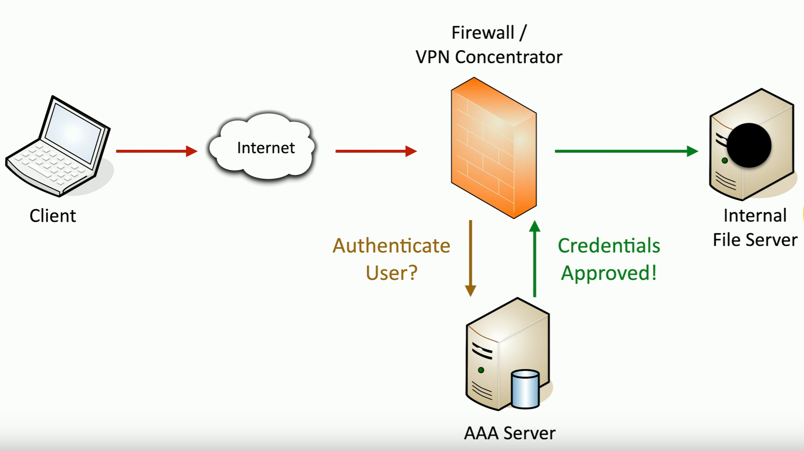
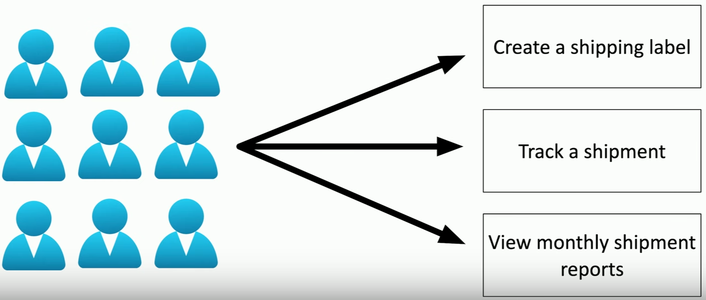
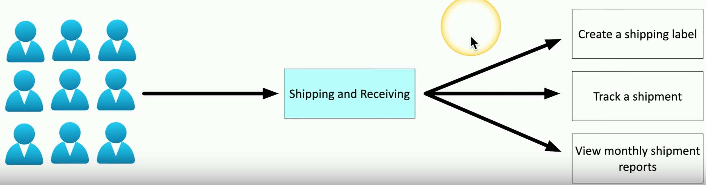

# AAA Framework
### Identification
- This is who you claim to be
- Usually your username
### Authentication
- Prove you are who you say you are
- Password and other authentication factors
### Authorization
- Based on your identification and authentication, what access do you have?
### Accounting
- Resources used: Login time, data sent and received, logout time
# Authenticating People

# Authenticating Systems
### You have to manage many devices
- Often devices that you'll never physically see
### A system can't type a password
 - And you may not want to store one
### How can you truly authenticate a device?
- Put a digitally signed certificate on the device
### Other business processes rely on the certificate
- Access to the VPN from authorized devices
- Management software can validate the end device
# Certificate Authentication
### An organization has a trusted Certificate Authority (CA)
- Most orgs maintain their own CAs
### The organization creates a certificate for a device
- And digitally signs the certificate with the org's CA
### The certificate can now be included on a device as an authentication factor
- The CA's digital signature is used to validate the certificate
# Authorization Models
### The user or device has now authenticated
- To what do they now have access?
- Time to apply an auth model
### Users and Services -> Data and Apps
- Associating individual users to access rights does not scale
### Put an auth model in the middle
- Defined by Roles, Orgs, Attributes, etc.
# No Authorization Model
### A simple relationship
- User -> Resource
### Some issues with this method
- Difficult to understand why an authorization may exist
- Does not scale

- It would be difficult to take every single user account and manually set up rights and permissions for every single resource that they need access to
- In this case, there's only three resources, but imagine if there were tens or hundreds of resources
- You would need to set those up for tens or hundreds of users
- This is why this is very difficult to scale
# Using an Authorization Model
### Add an abstraction
- Reduce complexity
- Create a clear relationship between the user and the resource
### Administration is streamlined
- Easy to understand the authorizations
- Support any number of users or resources

- Instead of manually mapping every single user to the individual authorizations they need, we just simply add all of the users to the shipping and receiving group
- With this one addition, we can give a large number of users access to the resources they might need, regardless of how many users there are and regardless of how many resources they need to access