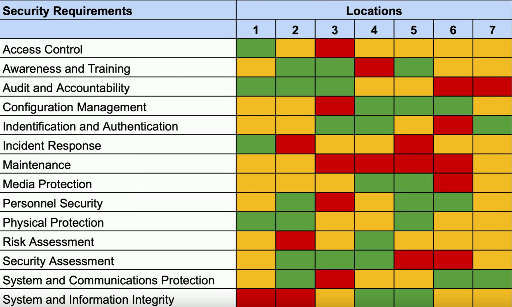

# Gap Analysis
### Where you are compared with where you want to be
- The "gap" between the two
### This may require extensive research
- There's a lot to consider
### This can take weeks or months
- An extensive study with numerous participants
- Get ready for emails, data gathering, and technical research
# Choosing the Framework
### Work towards a known baseline
- This may be an internal set of goals
- Some orgs should use formal standards
### Determine the end goal
- NIST Special Publiciation 800-171 Rev. 2, Protecting Controlled Unclassified Information in Nonfederal Systems and Organizations
- ISO/IEC 27001, Information Security Management Systems
# Evaluate People & Processes
### Get a baseline of employees
- Formal experience
- Current training
- Knowledge of security policies and procedures
### Examine the Current Processes
- Research existing IT systems
- Evaluate existing security policies
# Compare & Contrast
### The comparison
- Evaluate existing systems
### Identifying weaknesses
- Along with the most effective processes
### A detailed analysis
- Examine broad security categories
- Break those into smaller segments
# The Analysis & Report
### The Final Comparison
- Detailed baseline objectives
- A clear view of the current state
### Need a path to get from the current security to the goal
- This will almost certainly include time, money, and lots of change control
### Time to create the gap analysis report
- A formal description of the current state
- Recommendations for meeting the baseline
# Gap Analysis Overview
