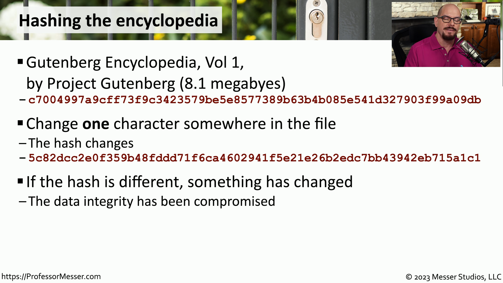
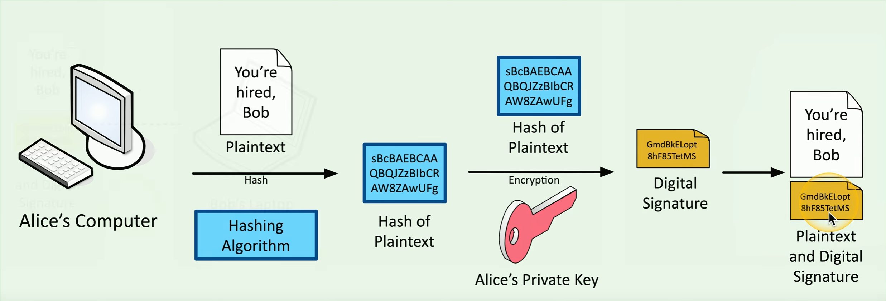
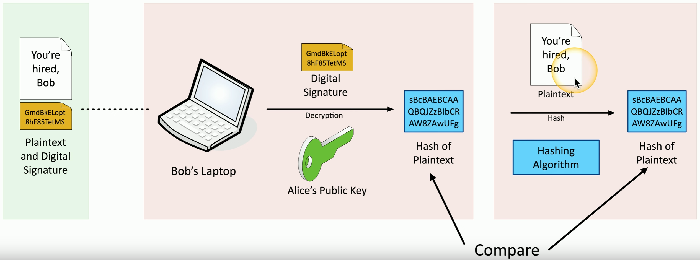

# Non-Repudiation
### You can't deny what you've said
- There's no taking it back
### Sign a Contract
- Your signature adds non-repudiation
- You really did sign the contract
- Others can see your signature
### Adds a different perspective for cryptography
- Proof of integrity
- Proof of origin, with high assurance of authenticity
# Proof of Integrity
### Verify data doesn't change
- The data remains accurate and consistent
### In cryptography, we use a hash
- Represent data as a short string of text
- A message digest, a fingerprint
### If the data changes, the hash changes
- If the person changes, you get a different fingerprint
### Doesn't necessarily associate data with an individual
- Only tells you if the data has changed

# Proof of Origin
### Prove the message wasn't changed
- Integrity
### Prove the source of the message
- Authentication
### Make sure the signature isn't fake
- Non-repudiation
### Sign with the private key
- The message doesn't need to be encrypted
- Nobody else can sign this (obviously)
### Verify with the public key
- Any change to the message will invalidate the signature
# Creating a Digital Signature

# Verifying a Digital Signature
