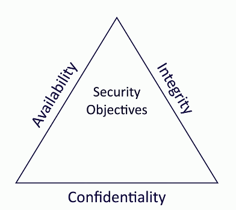

# The CIA Triad
### Combination of Principles
- The fundamentals of security
- Sometimes references as the AIC Triad to differentiate itself from the Central Intelligence Agency
### Confidentiality
- Prevent disclosure of information to unauthorized individuals or systems
### Integrity
- Messages can't be modified without detection
### Availability
- Systems and networks must be up and running

# Confidentiality
### Certain info should only be known by certain people
- Prevent unauthorized information disclosure
### Encryption
- Encode messages so only certain people can read it
### Access controls
- Selectively restrict access to a resource
### Two-factor Authentication
- Additional confirmation before information is disclosed
# Integrity
### Data is stored and transferred as intended
- Any modification to the data would be identified
### Hashing
- Map data of an arbitrary length to data of a fixed length
### Digital Signatures
- Mathematical scheme to verify the integrity of data
### Certificates
- Combine with a digital signature to verify an individual
### Non-repudiation
- Provides proof of integrity, can be asserted to be genuine
# Availability
### Information is accessible to authorized users
- Always at your fingertips
### Redundancy
- Build services that will always be available
### Fault tolerance
- System will continue to run, even when a failure occurs
### Patching
- Stability
- Close security holes