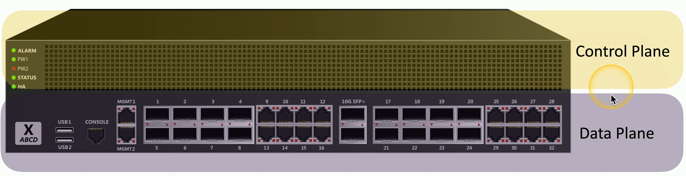
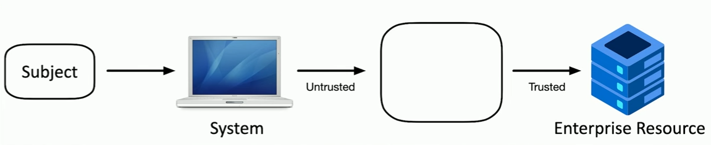
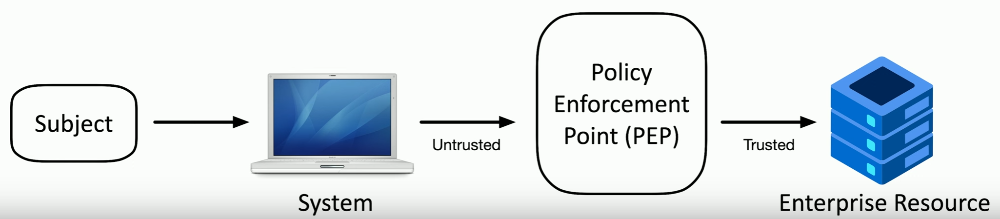
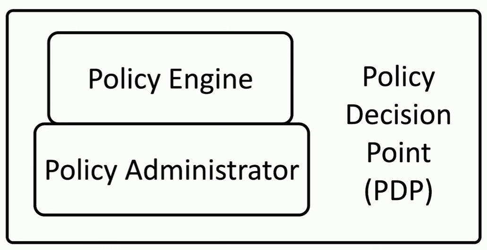
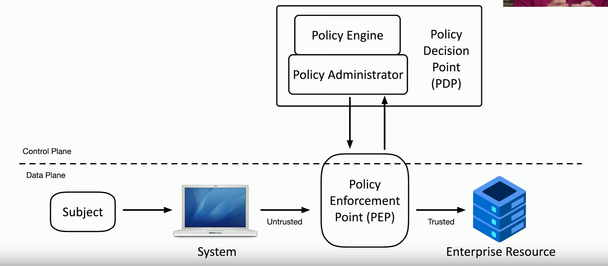

# Zero Trust
### Many networks are relatively open on the inside
- Once you're through the firewall, there are few security controls
### Zero trust is a holistic approach to network security
- Covers every device, every process, every person
### Everything must be verified
- Nothing is inherently trusted
- Multi-factor authentication, encryption, system permissions, additional firewalls, monitoring and analytics, etc.
# Planes of Operation
### Split the network into functional planes
- Applies to physical, virtual, and cloud components
### Data Plane
- Processes the frames, packets, and network data
- Processing, forwarding, trunking, encrypting, NAT
### Control Plane
- Manages the actions of the data plane
- Define policies and rules
- Determines how packets should be forwarded
- Routing tables,session tables, NAT tables
# Extending the Physical Architecture
### Separate into Functional Tasks
- Incorporate into hardware or software

# Controlling Trust
### Adaptive Identity
- Consider the source and the requested resources
- Multiple risk indicators:
	- Relationship to the org
	- Physical location
	- Type of connection
	- IP Address
	- etc.
- Make the authentication stronger, if needed
### Threat Scope Reduction
- Decrease the number of possible entry points
### Policy-driven Access Control
- Combine the adaptive identity with a predefined set of rules
# Security Zones
### Security is more than a one-to-one relationship
- Broad categorizations provide a security-related foundation
### Where are you coming from and where are you going
- Trusted, untrusted
- Internal network, external network
- VPN 1, VPN 5, VPN 11
- Marketing, IT, Accounting, Human Resources

### Using the zones may be enough by itself to deny access
- For example, **Untrusted** or **Trusted** zone traffic
### Some zones are implicitly trusted
- For example, **Trusted** to **Internal** zone traffic
# Policy Enforcement Point
### Subjects and Systems
- End users, applications, non-human entities
### Policy Enforcement Point (PEP)
- The gatekeeper
### Allow, monitor, and terminate connections
- Can consist of multiple components working together

# Applying Trust in the Planes
### Policy Decision Point
- There's a process for making an authentication decision
### Policy Engine
- Evaluates each access decision based on policy and other information sources
- Grant, deny, or revoke
### Policy Administrator
- Communicates with the Policy Enforcement Point
- Generates access tokens or credentials
- Tells the PEP to allow or disallow access

# Zero Trust Across Planes
