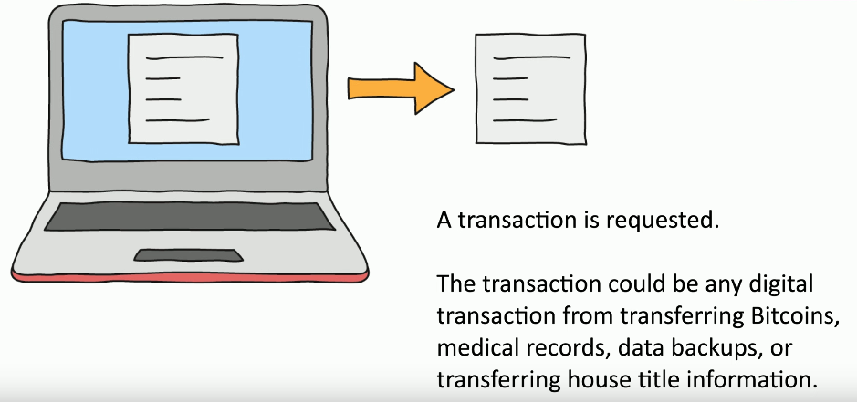
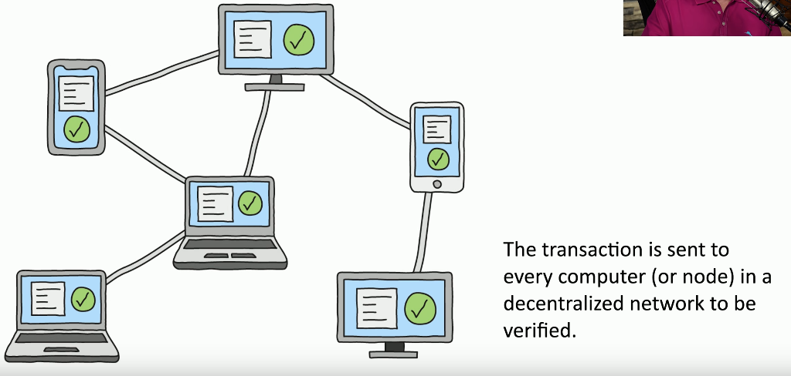
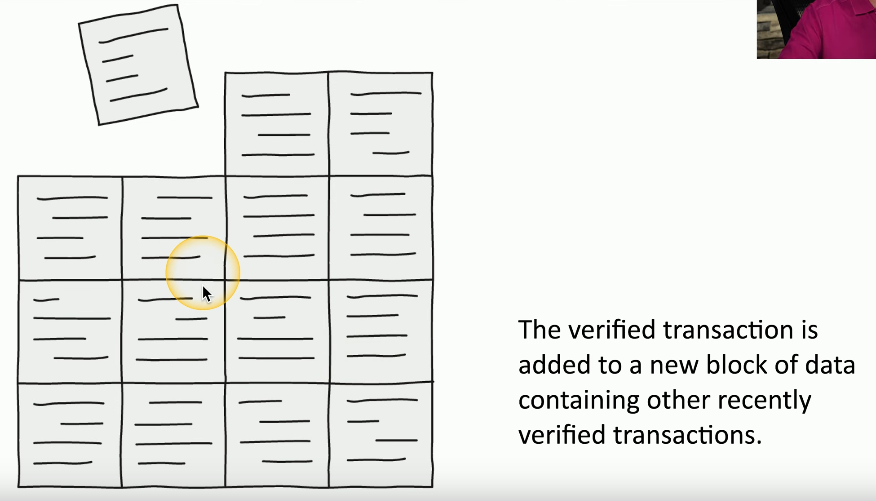
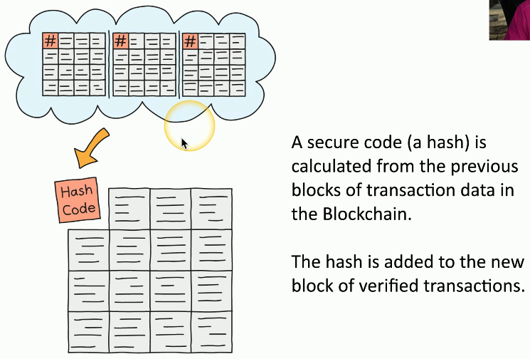
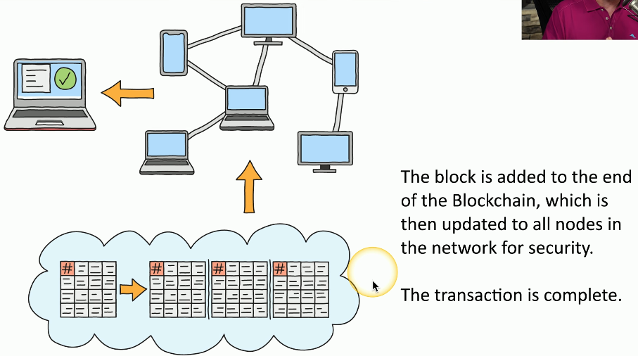
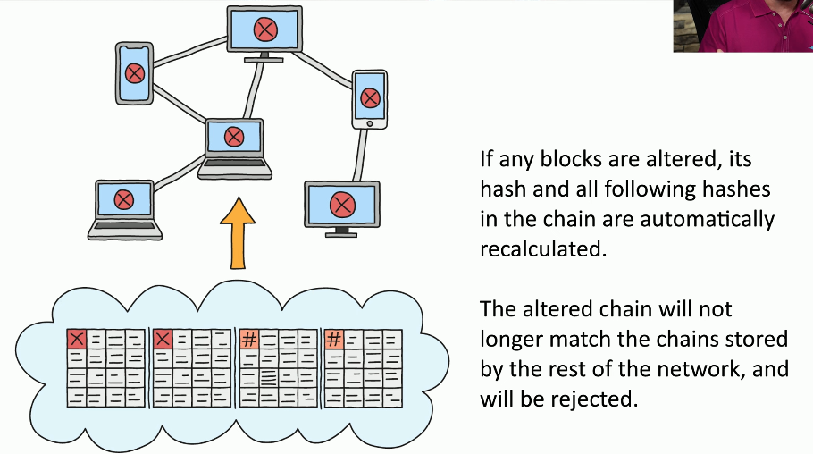

# Blockchain
### A distributed ledger
- Keep track of transactions
### Everyone on the blockchain network maintains the ledger
- Records and replicates to anyone and everyone
### Many practical applications
- Payment processing
- Digital identification
- Supply chain monitoring
- Digital voting
# The Blockchain Process

