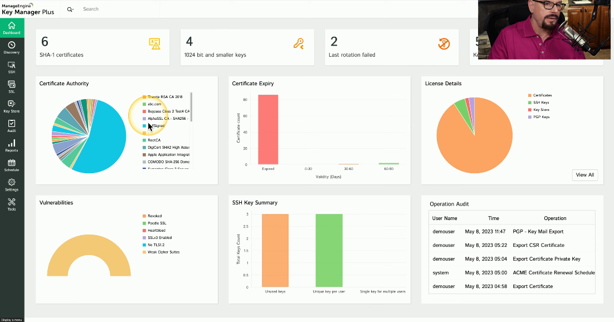

# Trusted Platform Module (TPM)
### A specification for cryptographic functions
- Cryptography hardware on a device
### Cryptographic Processor
- Random number generator, key generators
### Persistent Memory
- Unique keys burned in during manufacturing
### Versatile Memory
- Storage keys, hardware configuration information
- Securely store BitLocker keys
### Password Protected
- No dictionary attacks
# Hardware Security Module (HSM)
### Used in large environments
- Clusters, redundant power
- Securely store thousands of cryptographic keys
### High-End Cryptographic Hardware
- Plug-in card or separate hardware device
### Key Backup
- Secure storage in hardware
### Cryptographic Accelerators
- Offload that CPU overhead from other devices
# Key Management System
### Services are everywhere
- On-premises, cloud-based
- Many different keys for many different services
### Manage all keys from a centralized manager
- Often provided as third-party software
- Separate the encryption keys from the data
### All key management from one console
- Create keys for a specific service or cloud provider (SSL/TLS, SSH, etc.)
- Associate keys with specific users
- Rotate keys on regular intervals
- Log key use and important events
# Key Management Software Example

# Keeping Data Private
### Our data is located in many different places
- Mobile phones, cloud, laptops, etc.
- The most private data is often physically closest to us
### Attackers are always finding new techniques
- It's a race to stay one step ahead
### Our data is changing constantly
- How do we keep this data protected?
# Secure Enclave
### A protected area for our secrets
- Often implemented as a hardware processor
- Isolated from the main processor
- Many different technologies and names
### Provides extensive security features
- Has its own boot ROM
- Monitors the system boot process
- True random number generator
- Real-time memory encryption
- Root cryptographic keys
- Performs AES encryption in hardware
- And more...