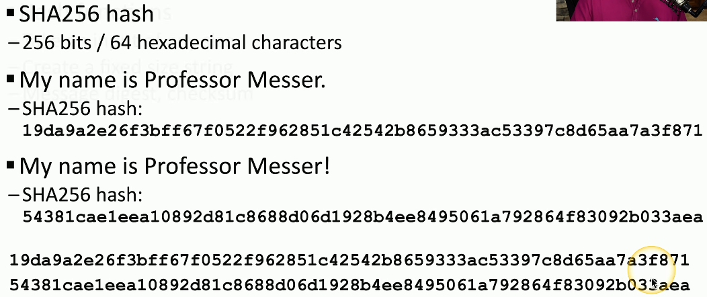
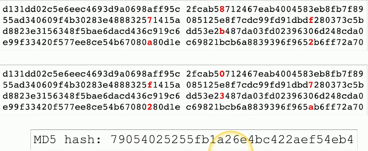
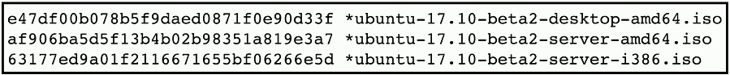
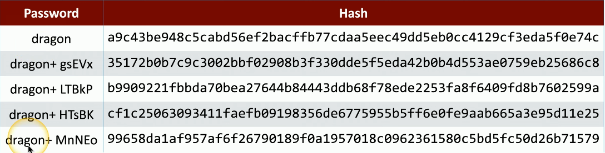
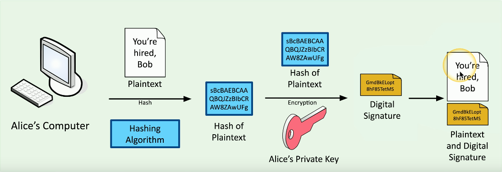
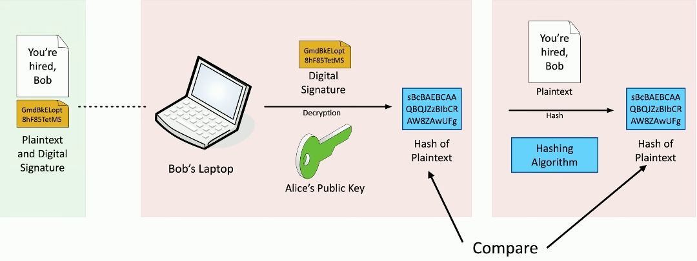

# Hashes
### Represent data as a short string of text
- A message digest, a fingerprint
### Represent data as a short string of text
- A message digest, a fingerprint
### One-Way Trip
- Impossible to recover the original message from the digest
- Used to store passwords/confidentiality
### Verify a downloaded document is the same as the original
- Integrity
### Can be a digital signature
- Authentication, non-repudiation, and integrity
# A Hash Example

# Collision
### Hash functions
- Take an input of any size
- Create a fixed size string
- Message digest, checksum
### The hash should be unique
- Different inputs should never create the same has
- If they do, it's a collision
### MD5 has a collision problem
- Found in 1996
- Don't use MD5 for anything important

# Practical Hashing
### Verify a downloaded file
- Hashes may be provided on the download site
- Compare the downloaded file hash with the posted hash value

### Password Storage
- Instead of storing the password, store a salted hash
- Compare hashes during the authentication process
- Nobody ever knows your actual password
# Adding Some Salt
### Salt
- Random data added to a password when hashing
### Every user gets their own random salt
- The salt is commonly stored with the password
### Rainbow tables won't work with salted hashes
- Additional random value added to the original password
### This slows down the brute force process
- It doesn't completely stop the reverse engineering
# Salting the Hash
### Each user gets a different random hash
- The same password creates a different hash

# Digital Signature
### Prove the message was not changed
- Integrity
### Prove the source of the message
- Authentication
### Make sure the signature isn't fake
- Non-repudiation
### Sign with the private key
- The message doesn't need to be encrypted
- Nobody else can sign this
### Verify with the public key
- Any change in the message will invalidate the signature
# Creating a Digital Signature

# Verifying a Digital Signature

