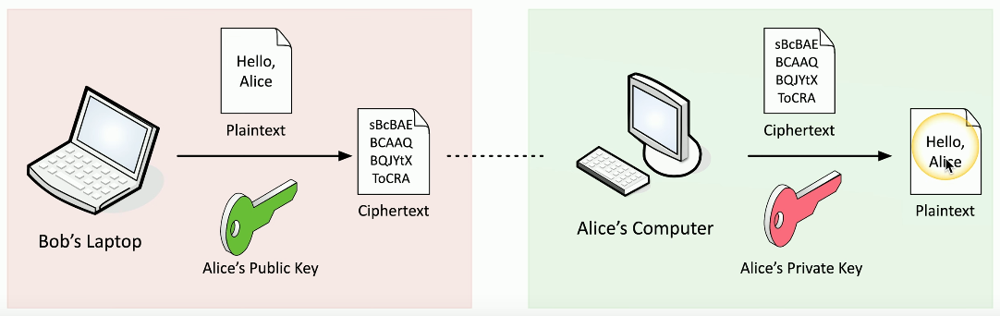

# Public Key Infrastructure (PKI)
### Policies, procedures, hardware, software, people
- Digital certificates: create distribute, manage, store, revoke
### This is a big, big, endeavor
- Lots of planning
### Also refers to the binding of public keys to people or devices
- The certificate authority
- It's all about trust
# Symmetric Encryption
### A single, shared key
- Encrypt with the key
- Decrypt with the same key
- If it gets out, you'll get another key
### Secret Key Algorithm
- A shared secret
### Doesn't scale very well
- Can be challenging to distribute
### Very fast to use
- Less overhead than asymmetric encryption
- Often combined with asymmetric encryption
# Asymmetric Encryption
### Public Key Cryptography
- Two (or more) mathematically related keys
### Private Key
- Keep this private
### Public Key
- Anyone can see this key
- Give it away
### The private key is the only key that can decrypt date encrypted with the public key
- You can't derive the private key from the public key
# The Key Pair
### Asymmetric Encryption
- Public Key Cryptography
### Key Generation
- Build both the public and private key at the same time
- Lots of randomization
- Large prime numbers
- Lots and lots of math
### Everyone can have the public key
- Only Alice has the private key
# Asymmetric Encryption
 
# Key Escrow
### Someone else holds your decryption keys
- Your private keys are in the hands of a 3rd-party
- This may be within your own organization
### This can be a legitimate business arrangement
- A business might need access to employee information
- Government agencies may need to decrypt partner data
### Controversial?
- Of course, but may still be required