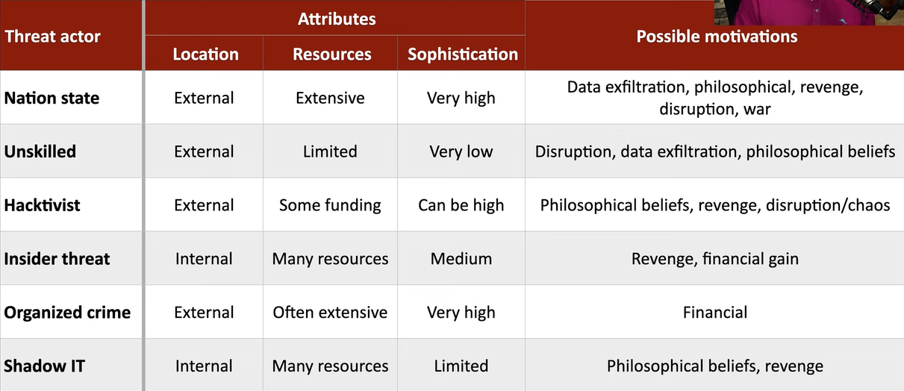

# Threat Actors
### The entity responsible for an event that has an impact on the safety of another entity
- Also called a malicious actor
### Threat actor attributes
- Describes characteristics of the attacker
### Useful to categorize the motivation
- Why is this attack happening
- Is this directed or random?
# Attributes of Threat Actors
### Internal/External
- The attacker is inside the house
- They're outside and trying to get in
### Resources/funding
- No money
- Extensive funding
### Level of sophistication/capability
- Blindly runs scripts or automated vulnerability scans
- Can write their own attack malware and scripts
# Motivation of Threat Actors
### What makes them tick?
- There's a purpose to this attack
### Motivations include
- Data exfiltration
- Espionage
- Service disruption
- Blackmail
- Financial gain
- Philosophical/political beliefs
- Ethical
- Revenge
- Disruption/chaos
- War
# Nation States
### External entity
- Government and national security
### Many possible motivations
- Data exfiltration, philosophical, revenge, disruption, war
### Constant attacks, massive resources
- Commonly an Advanced Persistent Threat (APT)
### Highest sophistication
- Military control, utilities, financial control
- United States and Israel destroyed 1,000 nuclear centrifuges with the Stuxnet worm
# Unskilled Attackers
### Runs pre-made scripts without any knowledge of what's really happening
- Anyone can do this
### Motivated by the hunt
- Disruption, data exfiltration, sometimes philosophical
### Can be internal or external
- But usually external
### Not very sophisticated
- Limited resources, if any
### No formal funding
- Looking for low hanging fruit
# Hacktivist
### A hacker with a purpose
- Motivated by philosophy, revenge, disruption, etc.
### Often an external entity
- Could potentially infiltrate to also be an insider threat
### Can be remarkably sophistication
- Very specific hacks
- DoS, website defacing, private document release
### Funding may be limited
- Some organizations have fundraising options
# Insider Threat
### More than just passwords on sticky notes
- Motivated by revenge, financial gain
### Extensive resources
- Using the organization's resources against themselves
### An internal entity
- Eating away from the inside
### Medium level of sophistication
- The insider has institutional knowledge
- Attacks can be directed at vulnerable systems
- The insider knows what to hit
# Organized Crime
### Professional Criminals
- Motivated by money
- Almost always an external entity
### Very sophisticated
- Best hacking money can buy
### Crime that's organized
- One person hacks
- One person manages the exploits
- Another person sells the data
- Another handles customer support
### Lots of capital to fund hacking efforts
# Shadow IT
### Going rogue
- Working around the internal IT organization
- Builds their own infrastructure
### Informational Technology can put up roadblocks
- Shadow IT is unencumbered
- Use the cloud
- Might also be able to innovate
### Limited resources
- Company budget
### Medium sophistication
- May not have IT training or knowledge
### Another Definition for More Clarity
-  Refers to information technology (IT) systems deployed by departments other than the central IT department, to bypass limitations and restrictions that have been imposed by central information systems
- While it can promote innovation and productivity, shadow IT introduces security risks and compliance concerns, especially when such systems are not aligned with corporate governance.
# Threat Actors
