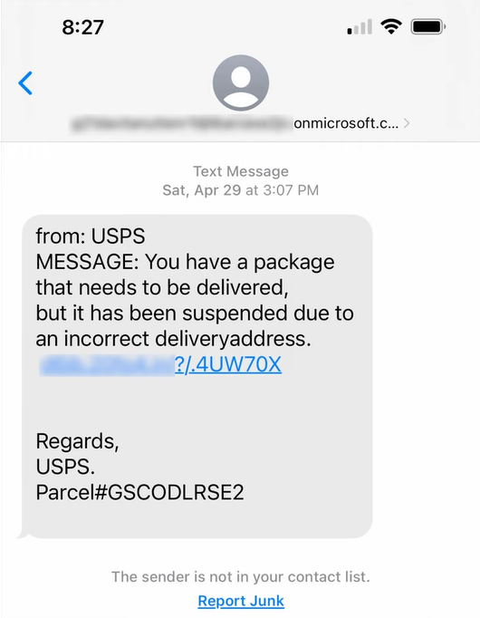
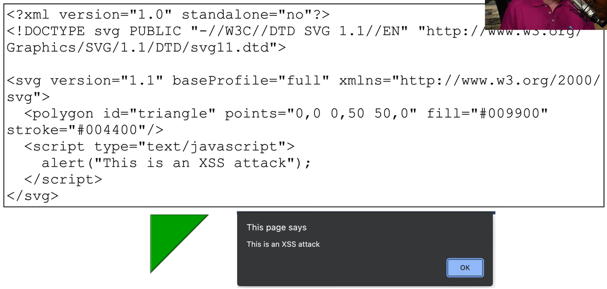

# Threat Vectors
### A method used by the attacker
- Gain access to or infect the target
- Also called "attack vectors"
### A lot of work goes into finding vulnerabilities in these vectors
- Some are more vulnerable than others
### IT security professionals spend their careers watching these vectors
- Protect existing vectors
- Find new vectors
# Message-Based Vectors
### One of the biggest (and most successful) threat vectors
- Everyone has at least one of these messaging systems
### Email
- Malicious links in an email
- Link to a malicious site
### SMS (Short Message Service)
- Attacks in a text message
### Phishing attacks
- People want to click links
- Links in an email, links send via text or IM
### Deliver the malware to the user
- Attach it to the email
- Scan all attachments, never launch untrusted links
### Social engineering attacks
- Invoice scams
- Cryptocurrency scams
### Example Phishing Message

# Image-based vectors
### Easy to identify a text-based threat
- It's more difficult to identify the threat in an image
### Some image formats can be a threat
- The SVG (Scalable Vector Graphic) format
- Image is described in XML (Extensible Markup Language)
### Significant security concerns
- HTML injection
- JavaScript attack code
### Browsers must provide input validation
- Avoids running malicious code
### Example of Potential XML XSS Attack Vector

# File-Based Vectors
### More than just executables
- Malicious code can hide in many places
### Adobe PDF
- A file format containing other objects
### ZIP/RAR files (or any compression type)
- Contains many different files
### Microsoft Office
- Documents with macros
- Add-in files
# Voice Call Vectors
### Vishing
- Phishing over the phone
### Spam over IP
- Large-scale phone calls
- Attackers use **VOIP (Voice Over IP)** to send automated spam calls
### War Dialing
- Attackers trying to find unpublished phone numbers that may give them access to systems
- It still happens
### Call Tampering
- Disrupt voice calls
- Attacker is trying to disrupt the systems using a **DoS (Denial of Service)** attack
# Removable Device Vectors
### Get around the firewall
- The USB interface
### Malicious software on USB flash drives
- Infect air gapped networks
- Industrial systems, high-security services
### USB devices can act as keyboards
- Hacker on a chip
### Data Ex-filtration
- Terabytes of data walk out the door
- Zero bandwidth used
# Vulnerable Software Vectors
### Client-based
- Infected executable
- Known (or unknown) vulnerabilities
- May require constant updates
### Agentless
- No installed executable
- Compromised software on the server would affect all users
- Client runs a new instance each time
# Unsupported System Vectors
### Patching is an important prevention tool
- Ongoing security fixes
### Unsupported systems aren't patched
- There may not even be an option
### Outdated operating systems
- Eventually, even the manufacturer won't help
### A single system could be an entry
- Keep your inventory and records current
- There's always the chance an employee may have an unaccounted machine with an outdated/vulnerable OS
# Unsecure Network Vectors
### The network connects everything
- Ease of access for the attackers
- View all (non-encrypted) data
### Wireless
- Need to make sure you're using all of the latest security protocols
- Outdated security protocols: WEP, WPA, WPA2
- Many orgs will perform periodic scans to detect any open or rogue access points in the network
### Wired
- Usually a good idea to enable **802.1X**: 
  - An authentication protocol that prevents anyone from gaining access to the network without the proper credentials
- Unsecured interfaces - No 802.1X
### Bluetooth
- Can possibly be used as a threat vector
- Can be used for **reconnaissance** to see where a particular system might be located
- Bluetooth implementation in a system may have limitations/vulnerabilities, serving as a possible entry point
# Open Service Ports
### Most network-based services connect over a TCP or UDP port
- An "open" port
### Every open port is an opportunity for the attacker
- Application vulnerability or misconfiguration
- Another reason why performing software updates is so important
- Sometimes a simple misconfiguration can allow unauthorized access into a system
### Every application has their own open port
- More services expand the attack surface
### Firewall rules
- Must allow traffic to open port
# Default Credentials
### Most devices have default usernames and passwords
- Change yours!
### The right creds provide full control
- Admin access
### Very easy to find the defaults for your access point or router
- https://www.routerpasswords.com
# Supply Chain Vectors
### Tamper with the underlying infrastructure
- Or manufacturing process
### Managed Service Providers (MSP)
- Access many different customer networks from one location
- If an attacker gets access to the MSP, they may then have access to any system
### Gain access to a network using a vendor

- 2013 Target credit card breach
- The attackers gained access to systems controlled by HVAC contractors hired by Target
- They were able to jump from the HVAC network to the main Target network and then to all of the stores in the Target systems

### Suppliers
- Counterfeit networking equipment
- Install backdoors, substandard performance and availability
- 2020 - Fake Cisco Catalyst switches 
  - Were identified because they weren't able to perform software updates properly
  - If not found, they could've been used as a threat vector and have malicious software installed on them that would allow attackers to take over those switches