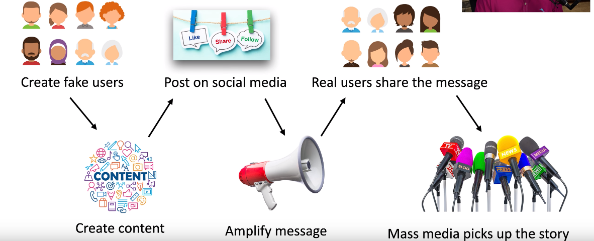

# Misinformation/Disinformation
### Disseminate factually incorrect information
- Create confusion and division
### Influence campaigns
- Sway public opinion on political and social issues
### Nation-State actors
- Divide, distract, and persuade
### Advertising is an option
- Buy a voice for your opinion
### Enabled through social media
- Creating, sharing, liking, amplifying
- The attackers are very good at using these social media sties and the tools available to them to create articles and then share and like them in order to get them in front of as many people as possible
- Example: Russians influencing the 2016 Presidential Election
### The Misinformation Process

# Brand Impersonation
### Pretend to be a well-known brand
- Coca-cola, McDonald's, Apple, etc.
### Create tens of thousands of impersonated sites
- Get into the Google index, click an ad, get a WhatsApp message
### Visitors are presented with a pop-up
- "You won! Special offer! Download the video!"
### Malware infection is almost guaranteed
- Display ads, site tracking, data exfiltration