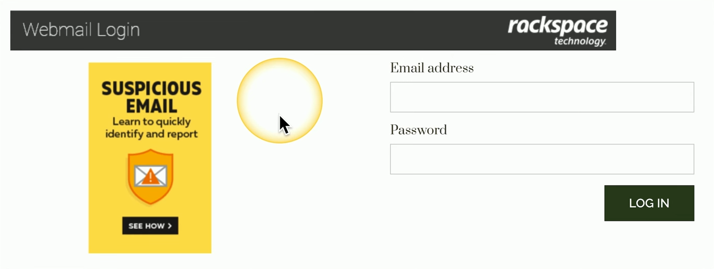
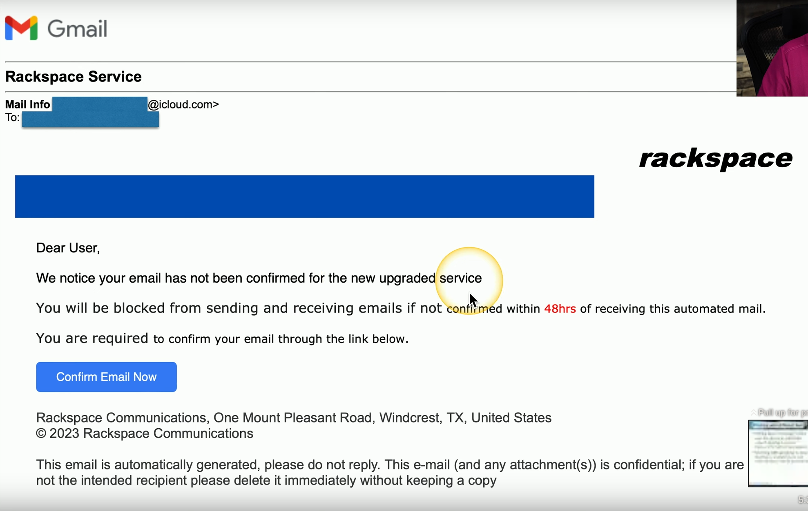
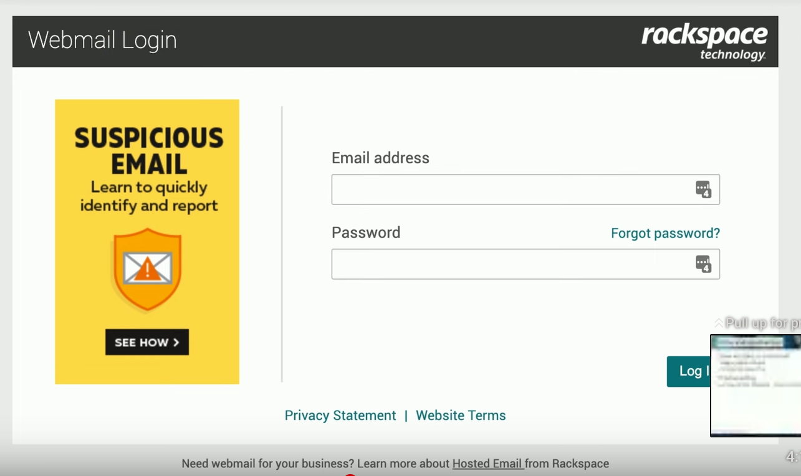
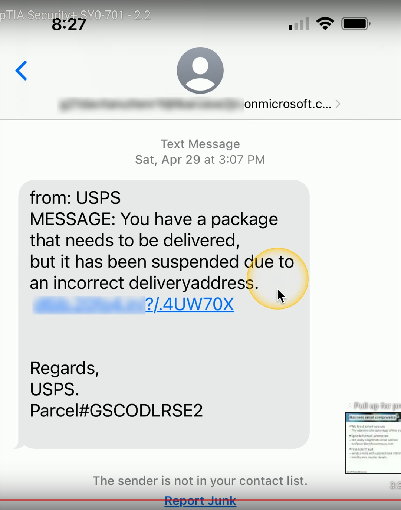

# Phishing
### Social Engineering With a Touch of Spoofing
- Often delivered by email, text, etc.
- Very remarkable when well done
### Don't be fooled
- Check the URL
### Usually there's something not quite right
- Spelling, fonts, graphics
### Example:

- Notice the spacing issues as well as the fonts
- This link was received from the following **phishing email**:

- Notice that the sender is associated with an icloud account, as well as the threatening verbiage of the account being blocked if not confirmed soon
- Below is a copy of what the real Rackspace login page looks like:

- While it's definitely a good enough replica to fool some people, you can clearly tell the differences between both pages
# Business Email Compromises
### We Usually Trust Email Sources
- The attackers take advantage of this trust
### Spoofed Email Addresses
- Made to look similar to the real thing, but is not actually a legitimate email address
- Example: professor@professormessor.com looks legit, but in reality his last name is spelled Messer with an e instead of an o
- By just looking at the sender's address at a quick glance, this can be enough to allow trust from the user to click on whatever is being sent to them
### Financial Fraud
- Sends emails with updated bank information
- Modify wire transfer details
### The Recipient Clicks the Link
- More often than not, these links/attachments will contain some type of malware that can be then used to gain access to important files, spy on the user, encrypt all the data, and the list goes on
# Tricks and Misdirection
### How are they so successful?
- Digital slight of hand
- It fools the best of us
### Typosquatting
- A type of URL hijacking that slightly modifies an existing URL people are familiar with
- Fake URL: https://professormessor.com
- Real URL: https://professormesser.com
- It can be hard to spot the difference at a quick glance
### Pretexting
- Lying to get information form the user
- The attacker plays a character in a situation they create
- For example, an attacker looking to gain financial details from a user may pretend to be customer support over the phone and say something like, "Hi, we're calling from (bank name) regarding an automated payment to your utility service that didn't go through. Could you please help us verify this transaction using your account information?"
# Phishing With Different Bait
### Vishing (Voice Phishing) is done over the phone or voicemail
- Caller ID spoofing is common
- Fake security checks or bank updates
### Smishing (SMS Phishing) is done via text
- Spoofing is a problem here as well
- Forwards links or asks for personal information
### Example of Smishing:

- The goal is to get you to click on this link and enter your login details in order to steal it for themselves
### Variations on a Theme
- The fake check scam, phone verification code scam, BOSS/CEO scam, advance-fee scam
- Some real-world examples of phishing can be found on https://reddit.com/r/Scams