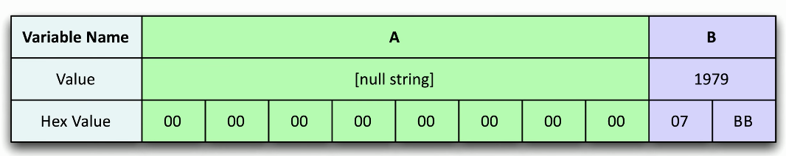
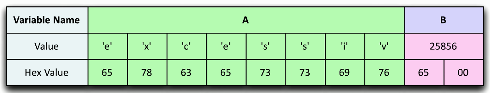

# Buffer Overflows
### Overwriting a buffer of memory
- Spills over into other memory areas
### Developers need to perform bounds checking
- The attackers spend a lot of time looking for openings
### Not a simple exploit
- Takes time to avoid crashing things
- Takes time to make it do what you want
### A really useful buffer overflow is repeatable
- Which means that a system can be compromised
- It always is providing the attacker with a particular function that gives them an advantage
# Example

- The attacker can take advantage of this issue to be able to create elevated rights and permissions for the attacker
- This is a case where we have two different variables in memory, variable A and variable B
- You can see that variable A has nothing currently written to it
- It's all 0s and has 8 different bytes that you could store as variable A
- Variable B has already been written to memory
- It's 2 bytes long, and you can see the decimal value of variable B is currently 1979
- Let's pretend that for this particular application, variable B contains information on how this application should provide rights and permissions
- If this value is below 2000, you have effectively user rights or guest rights for this application
- But, the attacker would like to have administrative rights
- In order to have admin rights, the value of variable B must be anything over 24,000
- Normally, variable B is not something that could be changed from inside the application
- But, this attacker has found a vulnerability with variable A that allows us to perform a **buffer overflow**
- The attacker knows that they can use 9 bytes into variable A, and that will fill up the 8 bytes of what normally would be variable A and it will overflow into the first byte of variable B

- In this example, the attacker has chose to store the word "excessive" into variable A
- Since excessive has nine characters, the first eight characters are stored as part of variable A and the ninth letter E, which is also the same as hex value 65, is stored as the first byte of variable B as it overflows into that particular variable
- You can see that this buffer flow has now changed the value of variable B, and no it's value is 25,856
- As we've said, any value of over 24,000 in variable B provides that user with the rights and permissions of an admin
- This attacker was effectively able to use a buffer overflow to provide elevated rights and permissions for this application without having any type of credentials as an admin