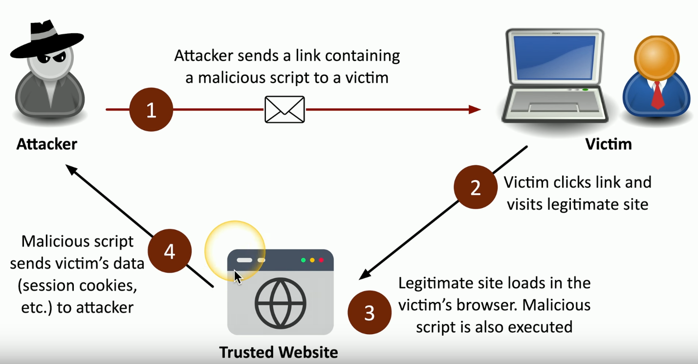
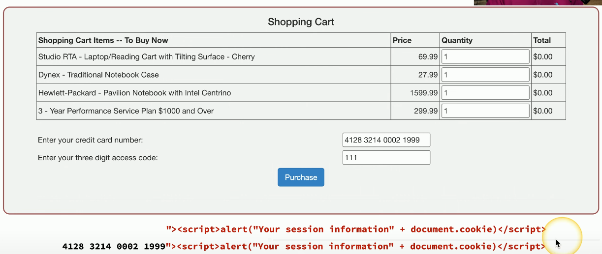
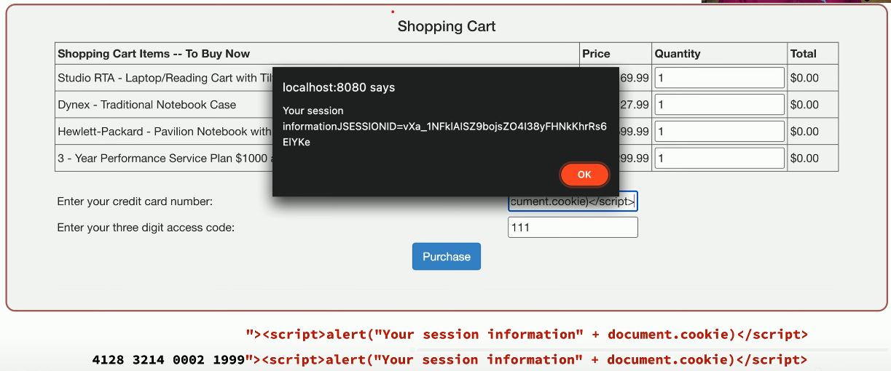

# Cross-Site Scripting (XSS)
### Why XSS and not CSS?
- CSS was already taken by Cascading Style Sheets
### Originally called cross-site because of browser security flaws
- Information from one site could be shared with another
### One of the most common web app vulnerabilities
- Takes advantage of the trust a suer has for a site
- Complex and varied
### XSS commonly uses JavaScript
- This is due to the fact that JavaScript is a very popular scripting language within our browsers
- Practically everyone has it enabled in their browser (Edge, Chrome, Firefox, etc.)
### Example XSS Attack Pattern

# Non-Persistent (Reflected) XSS Attack
### Web site allows scripts to run in user input
- Search box is a common source
### Attacker emails a link that takes advantage of this vulnerability
- Runs a script that sends credentials/session IDs/cookies to the attacker
### Script embedded in URL executes in the victim's browser
- As if it came from the server
### Attacker uses info gathered from the script to steal victim's info without their knowledge
- All while the user has no clue this has happened
### Vulnerable XSS Website
 
- The small amount of JavaScript on the bottom is a simple script that simply puts an alert message on the screen that shows your session information and then the session ID within the cookie for this site
- When putting in the credit card information, we'd also include that entire script along with the CC details
- When clicking the purchase button, a message appears on the screen with the info about our session as well as the session ID

- If this were a real attack, the attacker would not have anything pop up on the screen and instead have that session ID send directly to them without the user knowing
- That session information is now in the hands of the attacker allowing them access to view the credit card details
# Persistent (Stored) XSS Attack
### Attacker posts a message to a social network
- Includes the malicious payload
### It's now "persistent"
- Everyone gets the payload
### No specific target
- All viewers to the page
### For social networking, this can spread quickly
- Everyone who views the message can have it posted to their page
- Where someone else can view it and propagate it further
# Hacking a Subaru
### June 2017, Aaron Guzman
- Security researcher
### When authenticating with Subaru, users get a token
- This token never expires (this is a terrible idea)
### A valid token allowed any service request
- Even adding your email address to someone else's account
- Now you have full access to someone else's car
### Web front-end included a XSS vulnerability
- A user clicks a malicious link, and you have their token
# Protecting Against XSS
### Be careful when clicking untrusted links
- It's always better to type in the domain name yourself rather than blindly click on links sent in your email inbox
### Consider disabling JavaScript
- Or control with an extension
- This offers limited protection
### Keep your browsers and apps updated
- Avoid the nasty browser vulnerabilities
### Validate Input
- Don't allow users to add their own scripts to an input field