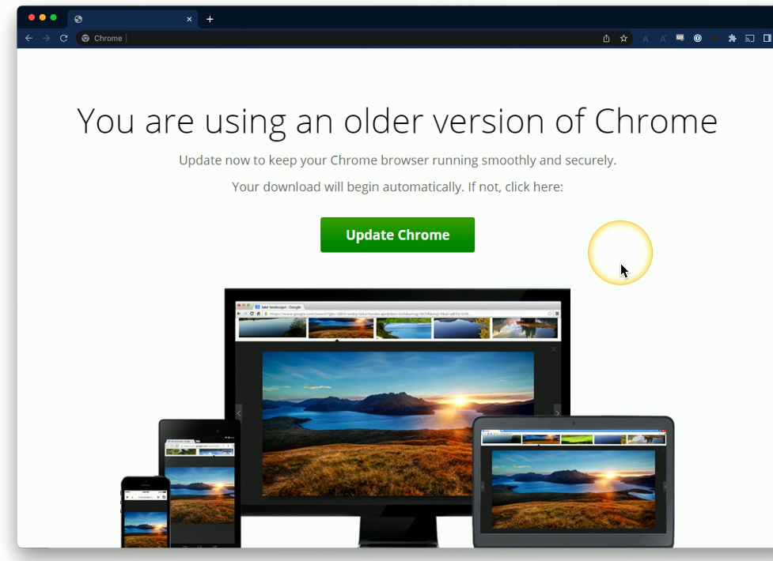

# Software Updates
### Always keep your OS and apps updated
- Updates often include bug fixes and security patches
### This process has its own security concerns
- Not every update is equally secure
### Follow best practices
- Always have a known-good backup
- Install from trusted sources
- A lot of times, a backup can save your system from an update gone wrong
# Application Update Example

- If this update screen is the first thing to pop up when opening up Chrome, there's a reasonable amount of trust that you can associate with this update
- However, if this same screen were to pop up after visiting a link provided from Google, then there may be a question as to whether or not what you're downloading is a safe/legit update
- It may be something you want to perform a bit of extra checks before clicking that **Update Chrome** button
# Downloading and Updating
### Install updates from a downloaded file
- Always consider your actions
- Every installation could potentially be malicious
### Confirm the source
- A random pop-up during web browsing is probably not legitimate
### Visit the developer's site directly
- Don't trust a random update button or random downloaded file
### Many OSs will only allow signed apps
- This means that we'll get a message during the update process that tells us that this application is from Microsoft, Adobe, Google, etc. and we can see the digital signature associated with that update
- Because the digital signature is put there by the application developer and our OS validates that signature, we can have a high level of trust that this particular update is legitimate
- Don't disable your security controls if you wish to have your OS validate these signatures
# Automatic Updates
### The app updates itself
- Often includes security checks/digital signatures
### Relatively trustworthy
- Comes directly from the developer
- However, this can still be exploited
### SolarWinds Orion supply chain attack
- Reported in December 2020
- Attackers gained access to the SolarWinds development system
- Added their own malicious code to the updates
- Gained access to hundreds of government agencies and companies