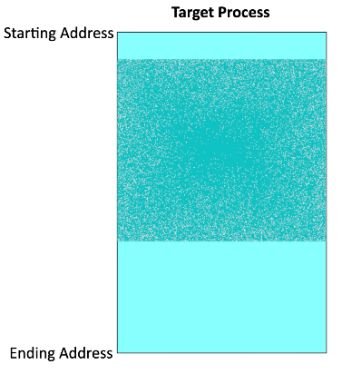
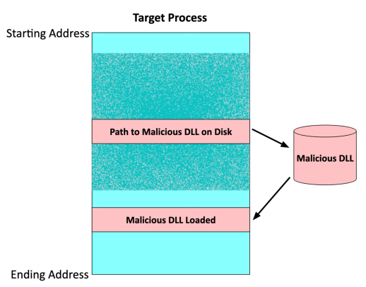

# Finding Malware
### Malware runs in memory
- Memory forensics can fid the malicious code
### Memory contains running processes
- DLLs (Dynamic Link Libraries)
- Threads
- Buffers
- Memory management functions
- And much more
### Malware is hidden somewhere
- Malware runs in its own process
- Malware injects itself into a legitimate process
# Memory Injection
### Add code into the memory of an existing process
- Hide malware inside of the process
### Get access to the data in that process
- And the same rights and permissions
- Perform a privelege escalation

# DLL Injection
### Dynamic-Link Library
- A Windows library containing code and data
- Many applications can use this library
### Attackers inject a path to a malicious DLL
- Runs as part of the target process
### One of the most popular memory injection methods
- Relatively easy to implement
