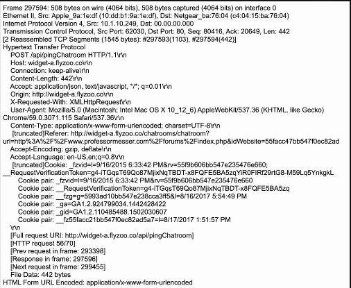
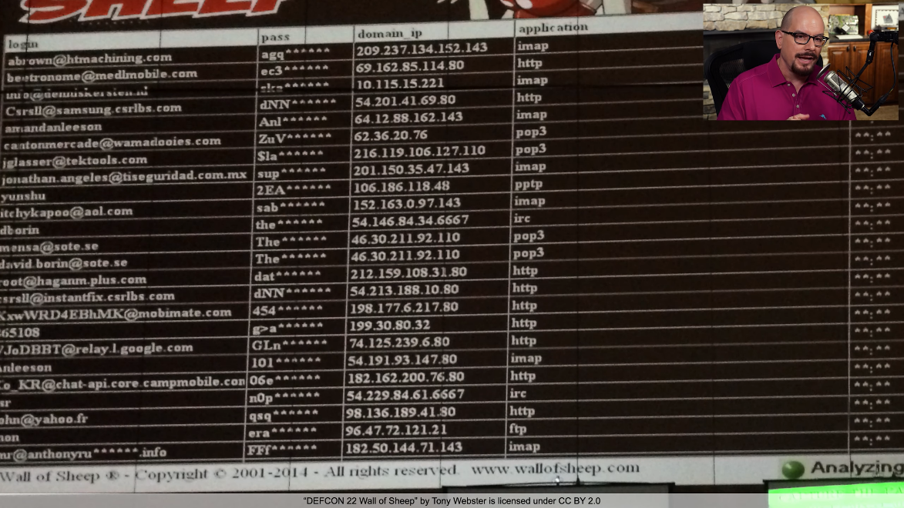

# Open Permissions
### Very easy to leave a door open
- The hackers will always find it
### Increasingly common with cloud storage
- Statistical chance of finding an open permission
### June 2017 - 14 million Verizon records exposed
- Third-party left an Amazon S3 data repository open
- Researcher found the data before anyone else
### Many, many other examples
- Secure your permissions!
# Unsecured Admin Accounts
### The Linux root account
- The Windows Administrator or superuser account
### Can be a misconfiguration
- Intentionally configuring an easy-to-hack password
### Disable direct login to the root account
- Use the su or sudo option
### Protect accounts with root or administrator access
- There shouldn't be a lot of accounts that have access to root or admin privileges
# Insecure Protocols
### Some protocols aren't encrypted
- All traffic sent in the clear
- Telnet, FTP, SMTP, IMAP
### Verify with a packet capture
- View everything sent over the network

- This is an example of a packet capture when accessing a site using HTTP
- Since HTTP was used instead of HTTPS, everything about that web session is available in clear text
### Use the encrypted versions
- SSH, SFTP, IMAPS, etc.
# Defcon Wall of Sheep

- Defcon displays this for everyone to see whenever someone is accessing any services on their network using an unencrypted protocl
# Default Settings
### Every application and network device has a default login
- Not all of these are ever changed
### Mirai Botnet
- Takes advantage of default configurations
- Takes over IoT (Internet of Things) devices
- 60+ default configurations
- Cameras, routers, doorbells, garage door openers, etc.
### Mirai released as open-source software
- This means anyone can use it whether you're a security researcher or a threat actor
# Open Ports and Services
### Services Will Open Ports
- It's important to manage access
### Often managed with a firewall
- Manage traffic flows
- Allow or deny based on port number or application
### Firewall rulesets can be complex
- It's easy to make a mistake
### Always test and audit
- Double and triple check to make sure there's no unintended access to any specific ports or devices