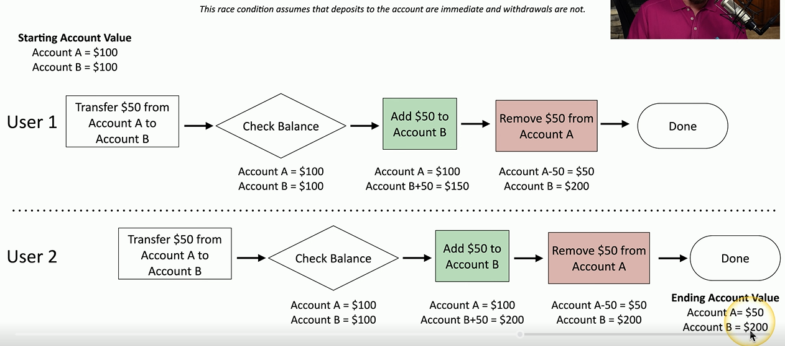

# Race Condition
### A programming conundrum
- When two events happen at nearly the same time with an application
- The application doesn't take into account that these two conditions may be operating simultaneously
- This is something application developers commonly check when they're building their application
- This can be bad if you've not planned for it as it can lead to unexpected results
### Time-of-check to time-of-use attack (TOCOU)
- This is a common type of race condition
- This means the application is going to check the system to retrieve info that may be stored
- After it retrieves that information, it may perform a particular function with that value
- Something might happen between the check and the use
- If you don't take into account that that value might change without you knowing it, you've run into a race condition
# Race Condition Example

- Since withdrawals are not updated immediately for all users, from user 2's perspective, Account A has $50 and Account B has $200
- This is the step where the race condition really occurs
- Because the application is not immediately taking into account any withdrawals, the final ending account value for user 2 is going to have Account A as $50 and account B as $200, when, in reality, account A should have $0
# Race Conditions Can Cause Big Problems
### January 2004 - Mars Rover "Spirit"
- Reboot when a problem is identified
- Problem is with the file system, so reboot because of the file system problem
- Reboot loop was the result
- The issue was fixed by Nasa developers remotely pushing code to bypass this particular error and get the rover back up and running
### Pwn2Own Vancouver - Tesla Model 3
- TOCTOU attack against the Tesla infotainment using Bluetooth
- Elevated privileges to root
- Earned $100,000 US prize and they keep the Tesla