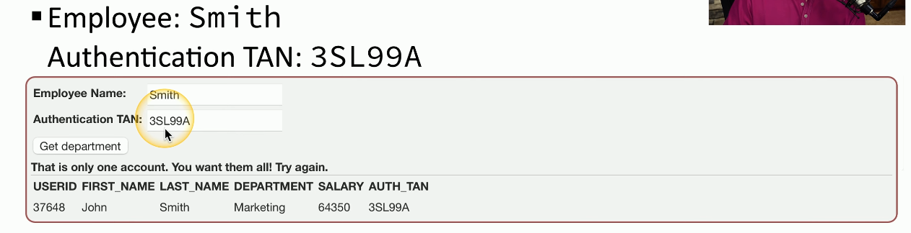
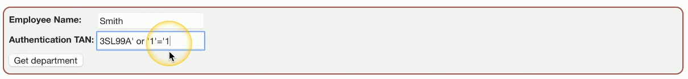
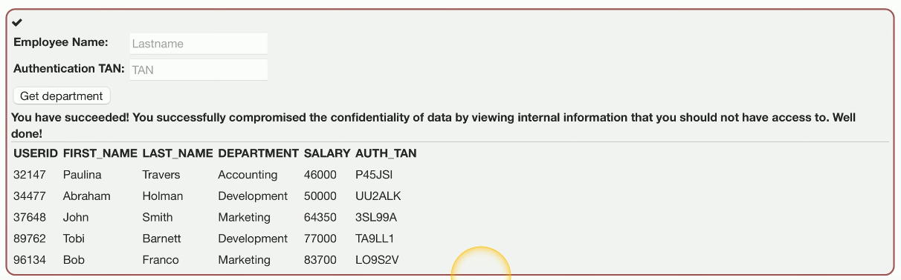

# Code Injection
### What is it?
- A common application attack where the attacker will insert their own code into the input that is accepted by the application
- i.e. inserting malicious code into a text field/prompt
### Enabled because of bad programming
- The application should properly handle input and output in order to ensure malicious code cant be submitted by the user
### Many different data types
- HTML, SQL, XML, LDAP, etc.
# SQL Injection
### SQL - Structured Query Language
- The most common relational database management system language
### SQL Injection (SQLi)
- Put your own SQL requests into an existing application
- Your application shouldn't allow this
### Can often be executed in a web browser
- Inject in a form or field
# Building a SQL Injection
### Example of website code:
- `"SELECT * FROM users WHERE name = '" + username + "'";`
### How this looks to the SQL database:
- `"SELECT * FROM users WHERE name = 'Professor'";`
### Add more information to the query:
- `"SELECT * FROM users WHERE name = 'Professor' OR '1' = '1'";`
- In this example, the  `'OR '1' = '1` is the **injected code**
### This could be very bad
- This could allow the attacker to view or delete all database information, add users, denial of service, etc.
# SQL Injection Demonstration

- This is what the application should normally show the user when they login with the proper credentials
- What will happen if they attempt to insert the same injection code as shown above?

- As you can see, they now have access to all of the database information