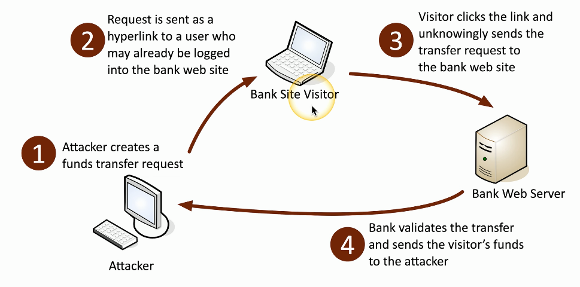

# Injection Attacks
### Code injection
- Adding your own code into a data stream
### Enabled because of bad programming
- The application should properly handle input and output
### So many different injectable data types
- HTML, SQL, XML, LDAP, etc.
# Buffer Overflows
### Overwriting a buffer of memory
- Spills over into other memory areas
### Developers need to perform bounds checking
- The attackers spend a lot of time looking for openings
### Not a simple exploit
- Takes time to avoid crashing things
- Takes time to make it do what you want
### A really useful buffer overflow is repeatable
- Which means that a system can be compromised
# Replay Attack
### Useful information is transmitted over the network
- A crafty hacker will take advantage of this
### Need access to the raw network data
- Network tap, ARP poisoning, Malware on the victim computer
### The gathered information may help the attacker
- Replay the data to appear as someone else
### This is not an on-path attack
- The actual replay doesn't require the original workstation
# Privilege Escalation
### Gain higher-level access to a system
- Exploit a vulnerability
- Might be a bug or design flaw
### Higher-level access means more capabilities
- This commonly is the highest-level of access
### These are high-priority vulnerability patches
- You want to get these holes closed very quickly
- Any use can be an admin
### Horizontal privilege escalation
- User A can access User B resources
# Mitigating Privilege Escalation
### Patch quickly
- Fix the vulnerability
### Updated anti-virus/anti-malware software
- Block known vulnerabilities
### Data Execution Prevention
- Only data in executable areas can run
### ASLR (Address Space Layout Randomization)
- Prevent a buffer overrun at a known memory address
# Elevation of Privilege Vulnerability
### CVE-2023-29336
- Win32k Elevation of Privilege Vulnerability
- May 2023
### Win32k Kernel Driver
- Affected Server 2008, 2008 R2, 2012, 2012 R2, 2016, and Windows 10
### Attacker would gain SYSTEM privileges
- The highest level of access
# Cross-Site Requests
### Cross-site requests are common and legitimate
- You visit professormesser.com
- Your browser loads text from the professormesser.com server
- Your browser loads a video from YouTube and pictures from Instagram
### HTML on ProfessorMesser.com directs requests from your browser
- This is normal and expected
- Most of these are unauthenticated requests
# The Client and the Server
### Website pages consist of client-side code and server-side code
- Many moving parts
### Client side
- Renders the page on the screen
- HTML, JavaScript
### Server side
- Performs requests from the client
- HTML, PHP
- Transfer money from one account to another
- Post a video on YouTube
# Cross-Site Request Forgery
### One-click attack, session riding
- XSRF, CSRF (Sea Surf)
### Takes advantage of the trust that a web application has for the user
- The web site trusts your browser
- Requests are made without your consent or knowledge
- Attacker posts a Facebook status on your account
### Significant web application development oversight
- The application should have anti-forgery techniques added
- Usually a cryptographic token to prevent forgery

# Directory Traversal
### Directory Traversal/Path Traversal
- Read files from a web server that are outside of the website's file directory
- Users shouldn't be able to browse the Windows folder
### Web server software vulnerability
- Won't stop users from browsing past the web server root
### Web application code vulnerability
- Take advantage of badly written code
###  Example
`GET http://www.example.com/show.asp?view=../../Windows/system.ini HTTP/1.1`