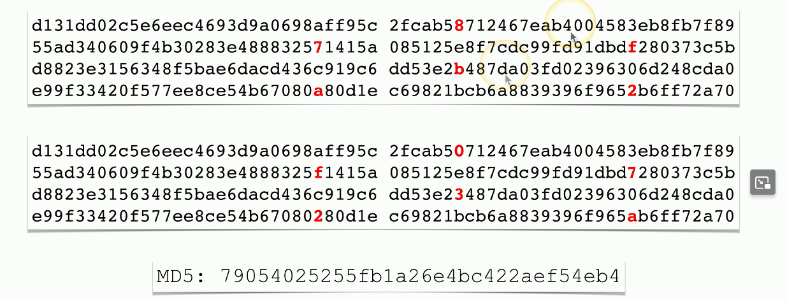
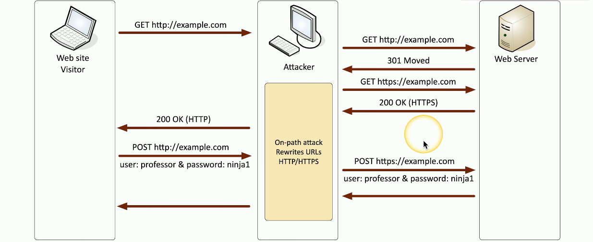

# Cryptographic Attacks
### You've encrypted data and sent it to another person
- Is it really secure?
- How do you know?
### The attacker doesn't have the combination (the key)
- So they break the safe (the cryptography)
### Finding ways to undo the security
- There are many potential cryptographic shortcomings
- The problem is often the implementation
# Birthday Attack
### In a classroom of 23 students, what is the chance of two students sharing a birthday?
- About 50%
- For a class of 30, the chance is about 70%
### In the digital world, this is a hash collision
- A hash collision is the same hash value for two different plaintexts
- Find a collision through brute force
### The attacker will generate multiple versions of plaintext to match the hashes
- Protect yourself with a large hash output size
# Collisions
### Hash digests are supposed to be unique
- Different input data should not create the same has
### MD5 hash
- Message Digest Algorithm 5
- First published in April 1992
- Collisions identified in 1996
### December 2008: Researchers created CA certificate that appeared legitimate when MD5 is checked
- Built other certificates that appeared to be legit and issued by RapidSSL
### Example

- While both of the plaintexts are very similar, there are slight differences as indicated by the red letters
- While this is supposed to result in two different hashes for each plaintext, a collision occurs and the same hash is given for both
# Downgrade Attack
### Instead of using perfectly good encryption, use something that's not so great
- Force the systems to downgrade their security
### SSL Stripping
- Combines an on-path attack with a downgrade attack
- Difficult to implement, but big returns for the attacker
- Attacker must sit in the middle of the conversation
- Victims browser page isn't encrypted
- Strips the S away for HTTPS
# SSL Stripping
