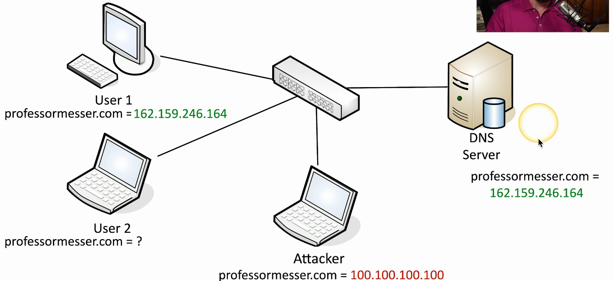
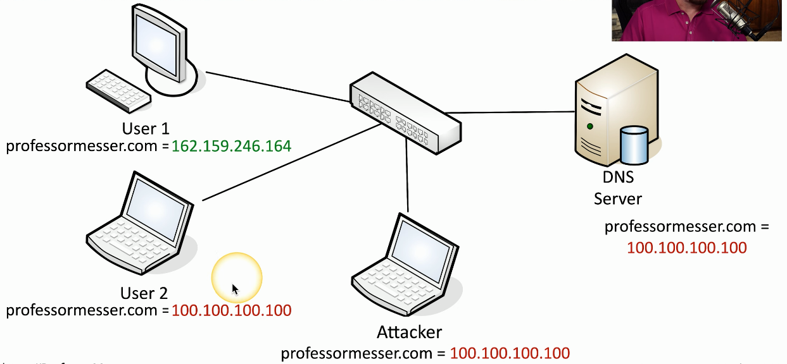

# DNS Poisoning
### Modify the DNS server
- Requires some crafty hacking
### Modify the client host file
- The local host file contains a list of fully qualified domain names and IP addresses very similar to what you would find on a DNS server
- Instead of your local machine querying the DNS server for this information, it simply looks through its local host file to see if the resolution happens to be in that file itself
- The host file takes precedent over DNS queries
### Send a fake response to a valid DNS request
- Requires a redirection of the original request or the resulting response
- Real-time redirection
- This is an on-path/man in the middle attack
# DNS Spoofing/Poisoning

- The attacker changed the legitimate IP address to the website directly on the DNS server causing User 2 to be redirected to the fake professormesser site
# Domain Hijacking
### Get access to the domain registration and you have control of where the traffic flows
- You don't need to touch the actual servers
- Determines the DNS names and IP addresses
### Many ways to get into the account
- Brute force
- Social engineer the password
- Gain access to the email address that manages the account
- The usual attack methods
### Saturday, October 22, 2016, 1PM
### Domain name registrations of 36 domains are changed
- Brazilian bank was hit
- Desktop domains, mobile domains, and more
### Under hacker control for 6 hours
- The attackers became the bank
### Results of the hack haven't been publicly released
- But we do know the bank had 5 million customers and $27 billion in assets at that time
# URL Hijacking
### Make money from your mistakes
- This might redirect users to a site that presents advertising, and that advertising would create a revenue stream for the attacker
### Sell the badly spelled domain to the actual owner
- The attacker may be able to sell this misspelled domain name to the legitimate domain name owner
### Redirect to a competitor of that domain
- Not as common, legal issues
### Phishing site
- Looks like the real site but is being used to gain legitimate credentials
### Infect with a drive-by download
- Cause users to download malware by simply visiting that URL
# Types of URL Hijacking
### Typosquatting/Brandjacking
- Takes advantage of poor spelling
### Outright misspelling
- professormesser.com vs professormessor.com
### A typing error
- progessormeser.com
### A different phrase
- professormessers.com
### Different top-level domain
- professormesser.org instead of .com