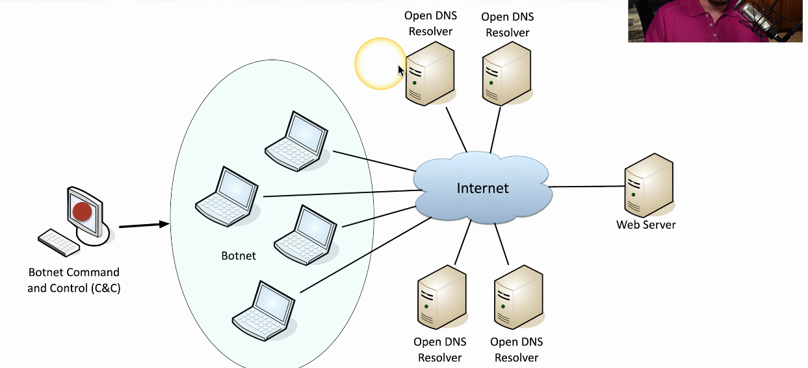
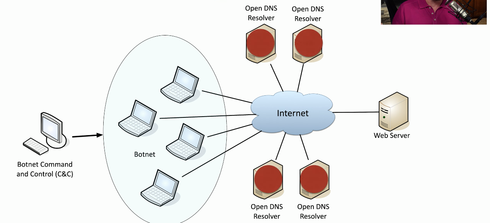

# Denial of Service
### Force a service to fail
- Overload the service so that no-one else can gain access
### Take advantage of a design failure or vulnerability
- Keep your systems patched!
### Cause a system to be unavailable
- Competitive advantage
### Create a smokescreen for some other exploit
- Precursor to a DNS spoofing attack
### Doesn't have to be complicated
- Shutting off the power would result in service being denied
# A "Friendly" DoS
### Unintentional DoSing
- This can be easily done if you aren't paying attention
### Network DoS
- Plugging in two switches to each other, and then doing it again creating a loop
- If you're not running a spanning tree, then you've probably brought down that particular part of the network, creating a DoS
### Bandwidth DoS
- Downloading multi-gigabyte files over a DSL line, using up all the available bandwidth
### The water line breaks
- If these are placed above the data center, this can be especially catastrophic
# Distributed Denial of Service (DDoS)
### Launch an army of computers to bring down a service
- Use all the bandwidth or resources - traffic spike
### This is why the attackers have botnets
- Thousands or millions of computers at your command
- At its peak, Zeus botnet infected over 3.6 million PCs
- Coordinated attack
### Asymmetric Threat
- The attacker may have fewer resources than the victim
# DDoS Reflection & Amplification
### Turn your small attack into a big one
- Often reflected off another device or service
### An increasingly common network DDoS technique
- Turn Internet services against the victim
### Uses protocols with little (if any) authentication or checks
- NTP, DNS, ICMP
- A common example of protocol abuse
# DNS Amplification DDoS

- The command and control for the botnet is managed from a central facility
- There are infected systems around the world that would make up the botnet
- It's also important for the attacker to find just the right DNS servers, the ones that aren't properly configured or properly secured
- these are called Open DNS Resolvers, and there may be a number of these that the attacker can use around the world
- This process starts with the botnet command and control sending the command to the botnet to start the DDoS attack
- This is sent as a message that says perform a query on the open DNS resolvers that are listed and have that query spoofed so that the results are being sent to a specific web server

- This query is sent from all of the botnet devices to these DNS resolvers
- Because this is amplification, the query that's made is relatively small, but the results form the DNS resolver will be much larger
- These DNS resolvers will send these responses to the web server IP address that was originally spoofed, effectively overwhelming it and causing the DDoS attack