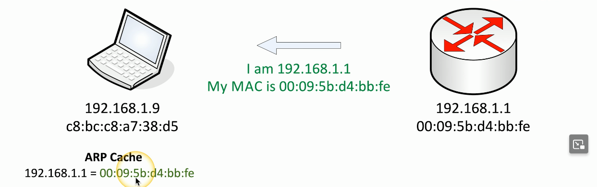

# On-path network Attack
### How can an attacker watch without you knowing?
- Formerly known as man-in-the-middle attack
### Redirects your traffic
- Then passes it on to the destination
- You never know your traffic was redirected
### ARP (Address Resolution Protocol) Poisoning
- On-path attack on the local IP subnet
- ARP has no security
# ARP Poisoning (Spoofing)

- When the laptop first connects to the network, it doesn't know the hardware address of the router
- All it has is the IP address of the router
- But of course, our devices communicate by MAC address
- It's the ARP (Address Resolution Protocol), that allows us to resolve the MAC address from an IP
- So the first thing the laptop will do is send a broadcast across the network asking if any device out there happens to be 192.168.1.1
- If you are this device, please send back your MAC address

- The router will see this broadcast and send back a response with the entire MAC address
- This should match the same address that is already associated with this router

- Once the laptop receives that ARP reply, it saves it into a cache on this local device
- This allows the laptop to continue to communicate to the router without having to perform this ARP request over and over again
- The ARP cache will normally time out after a number of minutes, at which time the ARP process will occur again
- It will be cached again and be saved locally for the next interval

- Now we have our attacker who has an IP address of 192.168.1.14
- This laptop already has the MAC address of the router saved in the cache, and there's not been another request to update that ARP information
- But the attacker sends an ARP response anyway that says that I am 192.168.1.1 and gives the laptop its own MAC address instead of the router's
- ARP doesn't have any type of authentication function or additional security, so when it receives this type of message it'll update its cache with this new detail

- You can see the ARP cache has now been overwritten with the 192.168.1.1 and the new MAC address of the attacker
- This same process will occur to the router, meaning that now whenever the router wants to talk to the laptop and vice versa, it'll send all of that information through the attacker's device allowing them to monitor traffic, modify information that's being sent, or effectively turn off the connection between the two devices
# On-path Browser Attack
### What if the middleman was on the same computer as the victim?
- Malware/Trojan does all of the proxy work
- Formerly known as man-in-the-browser
### Huge advantages for the attackers
- Relatively easy to proxy encrypted traffic
- Everything looks normal to the victim
### The malware in your browser waits for you to login to something sensitive
- Such as your bank account so it can steal all your money