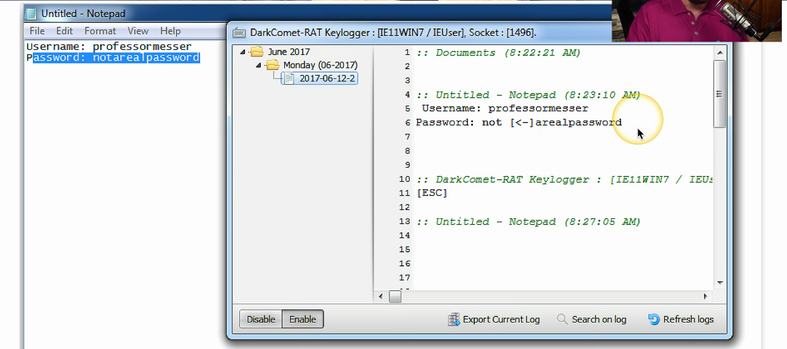

# Keyloggers
### Your keystrokes contain valuable information
- Web site login URLs, passwords, email messages
### Save all of your input
- Send it to the bad guys
### Circumvents encryption protections
- Your keystrokes are in the clear
### Other data logging
- Clipboard logging, screen logging, instant messaging, search engine queries
# Keylogger in Action

# Logic Bomb
### Waits for a predefined event
- Often left by someone with a grudge
### Time bomb
- Time or date
### User event
- Could be waiting for a specific user to log in to initiate the logic bomb
### Difficult to identify
- Difficult to recover if it goes off
# Real-World Logic Bombs
### March 19th, 2013 - South Korea
- Email with malicious attachment sent to South Korean organizations
- Posed as a bank email
- Trojan installs malware
### March 20th, 2013, 2PM Local Time
- Malware time-based logic-bomb activates
- Storage and MBR (Master Boot Record) deleted, system reboots to no OS being installed
### Affected a South Korean bank and ATMs
- ATMs read the following message: "Boot device not found. Please install an operating system on your hard disk."
# Preventing a Logic Bomb
### Difficult to recognize
- Each is unique
- No predefined signatures
### Process and procedures
- Formal change control
### Electronic monitoring
- Alert on changes
- Host-based intrusion detection, Tripwire, etc.
### Constant auditing
- An administrator can circumvent existing systems
# Rootkits
### Originally a Unix technique
- The "root" in rootkit
### Modifies core system files
- Part of the kernel
### Can be invisible to the OS
- Won't see it in the Task Manager
### Also invisible to traditional anti-virus utilities
- If you can't see it, you can't stop; it
# Finding and Removing Rootkits
### Look for the unusual
- Anti-malware scans
### Use a remover specific to the rootkit
- Usually built after the rootkit is discovered
### Secure boot with UEFI
- Security in the BIOS