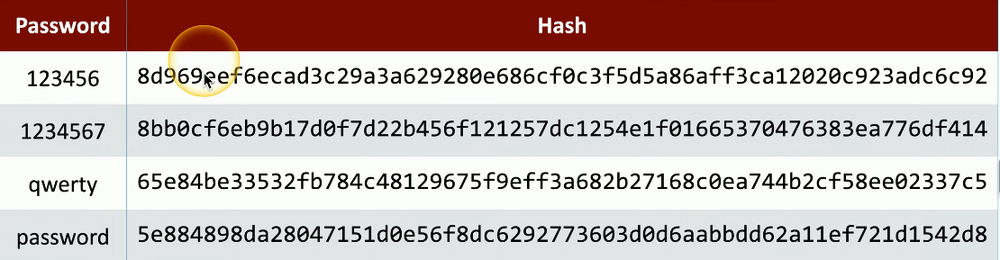
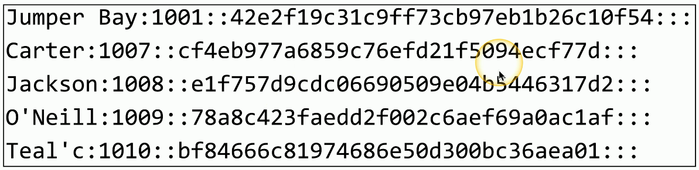
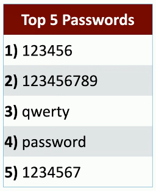
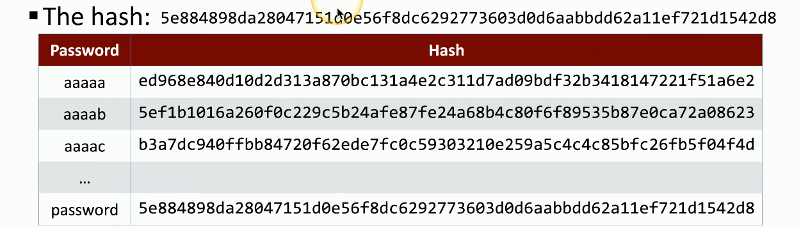

# Plaintext/Unencrypted Passwords
### Some applications store passwords "in the clear"
- No encryption, you can read the stored password
### Do NOT store passwords in plaintext
- Anyone with access to the password file or database has every credential
### What to do if your application saves passwords as plaintext
- Switch to a better one
# Hashing a Password
### Hashes represent data as a fixed-length string of text
- A message digest, or "fingerprint"
### Won't have a collision (hopefully)
- Different inputs shouldn't have the same has
### One-way trip
- Impossible to recover the original message from the digest
- A common way to store passwords
# A Hash Example
### SHA-256 Hash
- Used in many applications

# The Password File
### Different across OS's and Applications
- Different hash algorithms

- This file allows the username to be visible, but all the passwords are hashed
# Spraying Attack
### Try to login with an incorrect password
- Eventually you're locked out
### There are some common passwords
- https://en.wikipedia.org/wiki/List_of_the_most_common_passwords
### Attack an account with the top three (or more) passwords
- If they don't work, move to the next account
- No lockouts, no alarms, no alerts

# Brute Force
### Try every possible password combination until the hash is matched
### This might take some time
- A strong hashing algorithm slows things down
### 
### Brute Force Attacks - Online
- Keep trying the login process
- Very slow
- Most accounts will lockout after a number of failed attempts
### Brute Force the Hash - Offline
- Obtain the list of users and hashes
- Calculate a password hash, compare it to a stored hash
- Large computational resource requirement