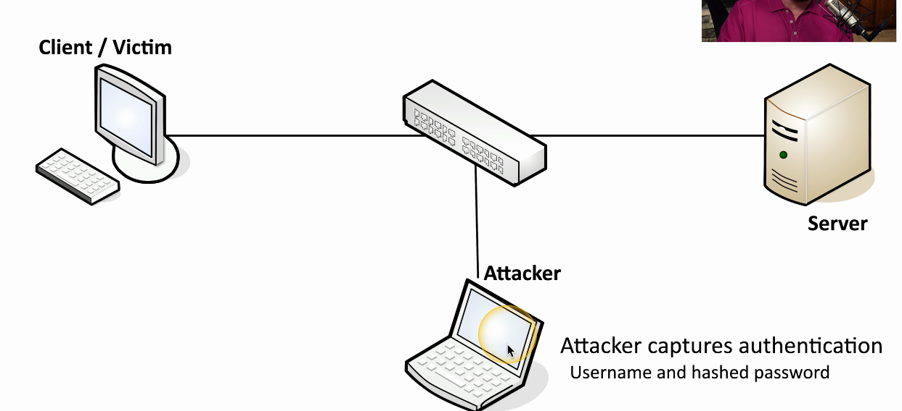
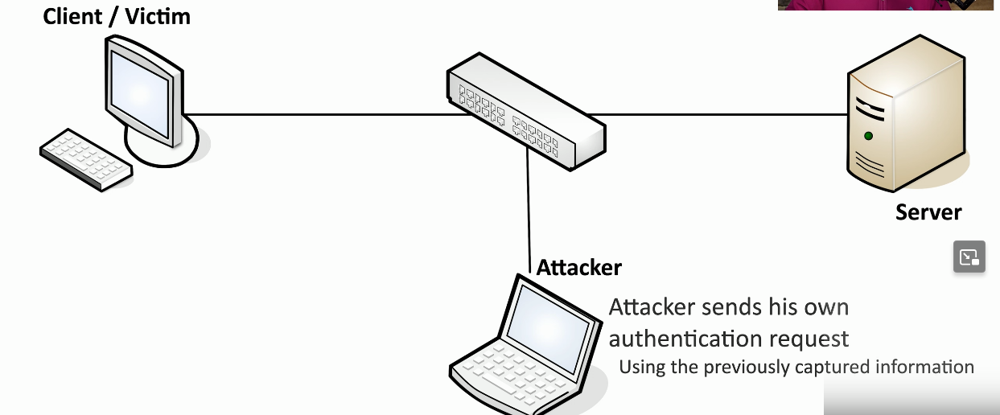
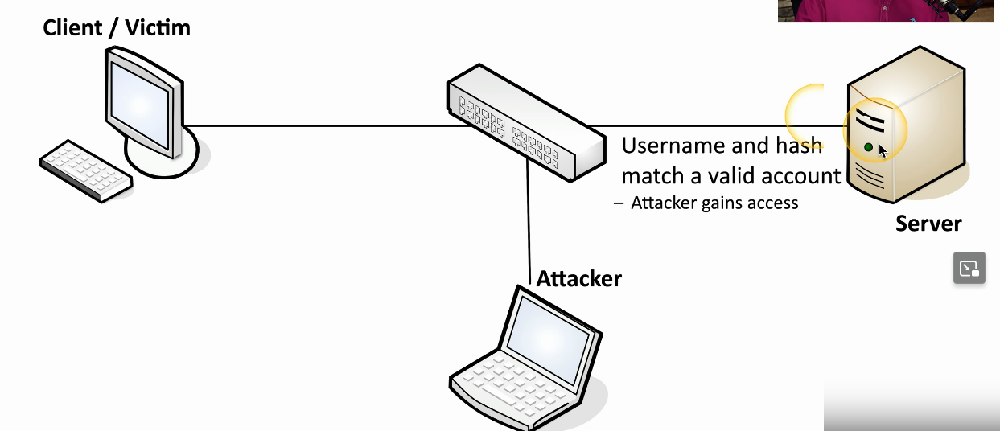
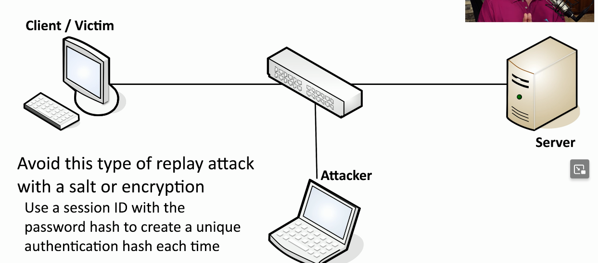
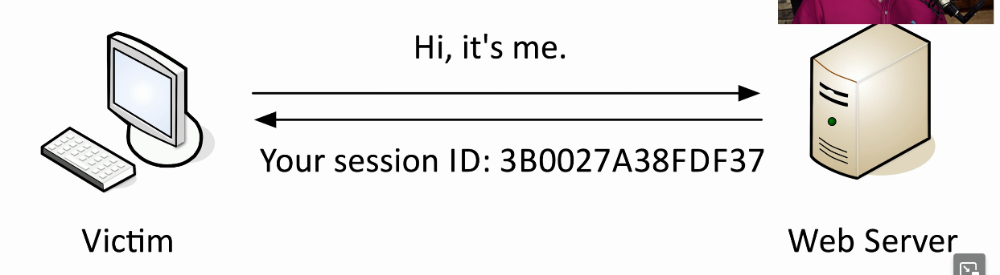
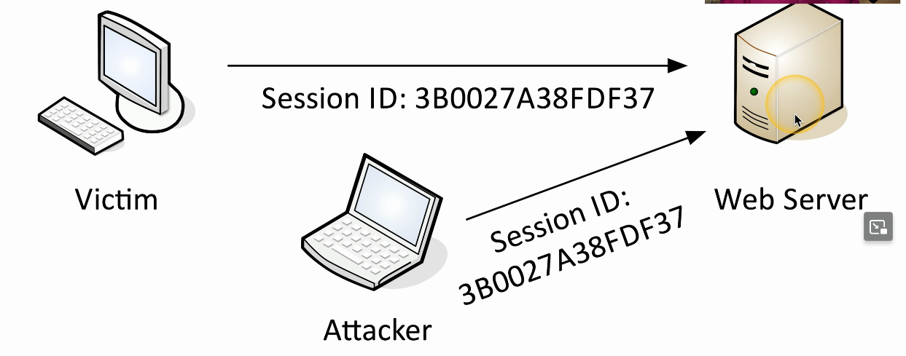

# Replay Attack
### Useful information is transmitted over the network
- A crafty hacker will take advantage of this
### Need access to the raw network data
- Network tap, ARP poisoning, Malware on the victim computer
### The gathered information may help the attacker
- Replay the data to appear as someone else
### This is not an on-path attack
- The actual replay doesn't require the original workstation
# Pass the Hash

# Browser Cookies and Session IDs
### Cookies
- Information stored on your computer by the browser
### Used for tracking, personalization, session management
- Not executable, not generally a security risk unless someone gets access to them
### Could be considered a privacy risk
- Lots of personal data in there
### Session IDs are often stored in the cookie
- Maintains sessions across multiple browser sessions
# Session Hijacking (Sidejacking)

- Occurs when a user authenticates initially with a web server
- They provide login creds and receive a session ID
- If the attacker gains access to this, they can use it for subsequent sessions to the web server

- Every time they use this session ID, the web server thinks it's coming from the original victim's computer, which is now logged in
- The attacker would now have access to everything the victim machine would have on that web server
# Header Manipulation
### Information gathering
- Wireshark, Kismet
### Exploits
- XSS
### Modify headers
- Tamper, Firesheep, Scapy
### Modify cookies
- Cookies Manager+ (Firefox extension)

# Prevent Session Hijacking
### Encrypt end-to-end
- They can't capture your session ID if they can't see it
- Additional load on the web server (HTTPS)
- Firefox setting: HTTPS-Only Mode
- Many sites are now HTTPS-only
### Encrypt end-to-somewhere
- At least avoid capture over a local wireless network
- Still in the clear for part of the journey
- Personal V