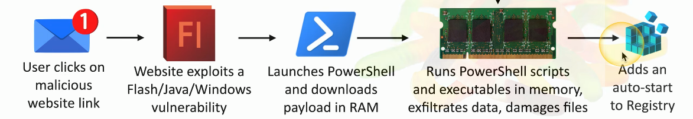
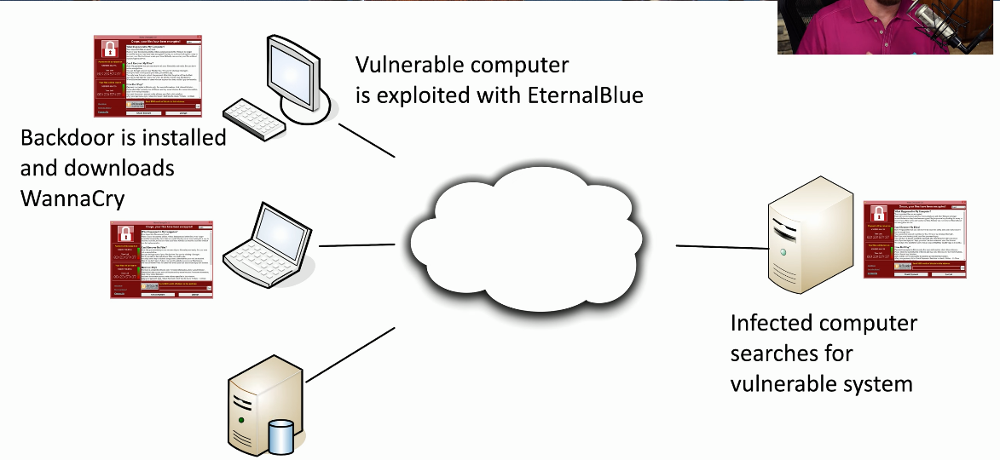

# Virus
### Malware that can reproduce itself
- It needs you to execute a program
### Reproduces through file systems or the network
- Just running a program can spread a virus
### May or may not cause problems
- Some viruses are invisible, some are annoying
### Anti-virus is very common
- Thousands of new viruses every week
- Is your signature file updated?
# Virus Types
### Program Viruses
- Requires the user to click a link or an executable to run the virus as an application
### Boot Sector Viruses
- The virus automatically runs as the system is booting
### Script Viruses
- Operating system and browser-based
### Macro Viruses
- Common in Microsoft Office
# Fileless Virus
### A Stealth Attack
- Does a good job of avoiding anti-virus detection
### Operates in memory
- But never installed in a file or application
### Example

# Worms
### Malware that self-replicates
- Doesn't need you to do anything
- Uses the network as a transmission medium
- Self-propagates and spreads quickly
### Worms are pretty bad things
- Can take over many systems very quickly
### Firewalls and IDS/IPS can mitigate many worm infestations
- Doesn't help much once the worm gets inside
# WannaCry Worm
