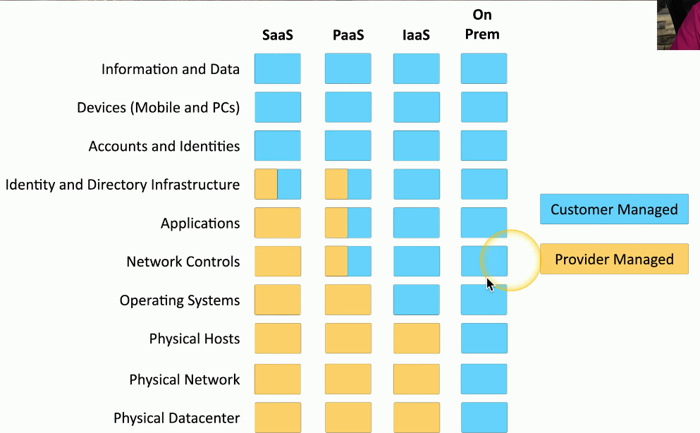
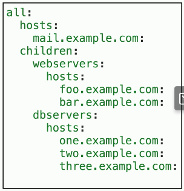
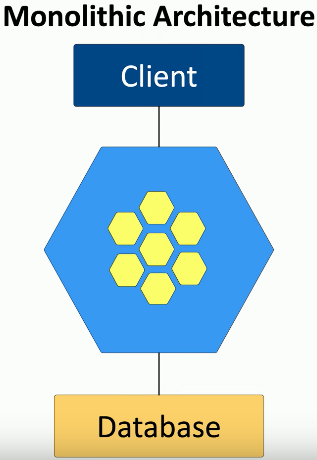
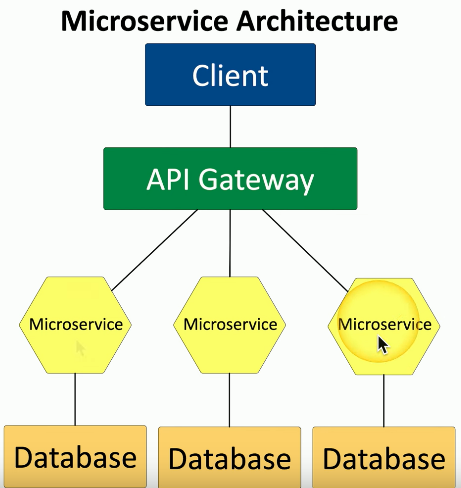

# Cloud Responsibility Matrix
### IaaS, Paas, Saas, etc.
- Infrastructure as a Service
- Platform as a Service
- Software as a Service
- Who is responsible for security?
### Security should be well documented
- Most cloud providers provide a matrix of responsibilities
- Everyone knows up front
### These responsibilities can vary
- Different cloud providers
- Contractual agreements
# Responsibility Matrix Example

- This matrix is broken up by each service type as well as on-prem AKA on-premises
- While most boxes clearly define who the responsibility falls on, some examples showcase that there is shared responsibility that occurs for everything on that level
- For this cloud provider, if you're wondering who's responsible for the OS, if this is a SaaS, it's the provider, PaaS is the provider, while both IaaS and obviously on-prem would be the responsibility of the customer
- You can compare that with a section of the matrix for accounts and identities that would obviously have a significant security concern
- In the case of this cloud provider, the customer is always responsible for anything associated with their accounts
# Hybrid Considerations
### Hybrid Cloud
- More than one public or private cloud
- We refer to this as a hybrid cloud
- Although using different providers adds flexibility, it also includes an extra level of complexity when you're needing to manage across these providers
### Network protection mismatches may occur between the different providers
- This affects the following:
	- Authentication across platforms
	- Firewall configurations
	- Server settings
### Different security monitoring
- Logs are diverse and cloud-specific
### Data leakage
- Data is shared between the providers and would have to traverse the public internet
- This results in a higher chance in data being intercepted by an attacker causing a potential data leak or breach
# Third-party vendors in the cloud
### You, the cloud provider, and third parties
- Infrastructure technologies
- Cloud-based appliances
### Ongoing vendor risk assessments
- Part of an overall vendor risk management policy
### Include third-party impact for incident response
- Everyone is part of the process
### Constant monitoring
- Watch for changes and unusual activity
# Infrastructure as Code

### Describe an infrastructure
- Define servers, network, and applications as code
### Modify the infrastructure and create versions
- The same way you version application code
### Use the description (code) to build other application instances
- The code diagram can be transferrable to new applications by following the same rules you set for past ones
### An important concept for cloud computing
- Build a perfect version every time
# Serverless Architecture
### Function as a Service (FaaS)
- Applications are separated into individual, autonomous functions
- This removes the need for a server to store the entire application and instead only breaks it down for specific functions to handle certain needs
- This also removes the OS from the equation as these functions should be able to be used with the best fit OS at that point in time
### Developer still creates the server-side logic
- Runs in a stateless compute container
### May be event triggered and temporary
- You may only need to run this function whenever it's needed
- This saves time and money, especially on a public cloud-based infrastructure
- If the application needs to access a particular function, it can be built in real time in the cloud
- That function can then be referenced for the application
- If it's no longer necessary to keep running that compute container, it can then be removed from the cloud until you need it again
# Microservers and APIs

### Monolithic Applications
- One big application that does everything
### Application contains all decision making processes
- User interface
- Business logic
- Data input and output
### Code challenges
- Large codebase that needs to be installed on one local machine
- If that application needs to be updated, we need to process a change control
- We need to send the changes down to that particular device
- It needs to be installed on that machine, and then we are able to use the newest version
# Microservers and APIs

### APIs
- Application Programming Interfaces
- Allows us to programmatically control the way that an application is working
### API is the "glue" for the microservices
- Work together to act as the application
- Break out individual services for the application and run them as separate instances in the cloud
- All you'd need to do as the client is talk to the API gateway, which would then send the request to the appropriate microservice
### Scalable
- Scale just the microservices you need
- If a certain portion of the application is being used more than others, you can roll out additional microservices to handle that load
### Resilient
- Outages are contained
- Losing a particular microservice won't cause the entire application to stop working
### Security and Compliance
- Containment is built-in
- Since the security is based on each particular microservice, you can provide the proper amount of security based on the service that happens to be running