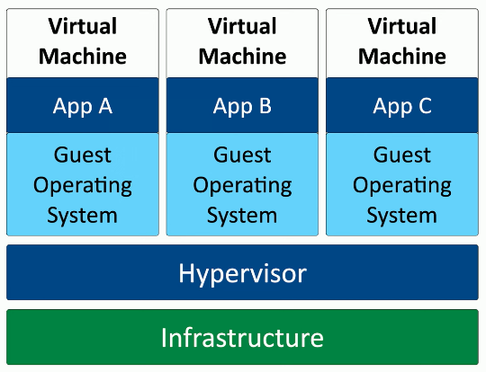
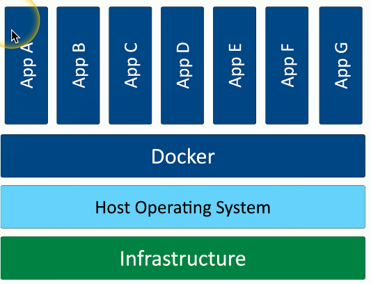
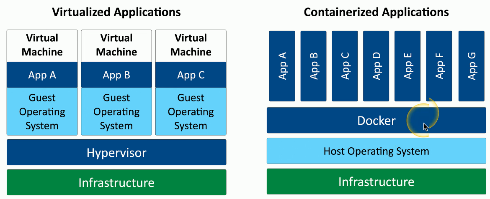

# Attacks can happen anywhere
### Two categories for IT security
- Some might say on-prem data is more secure, while others might say cloud-based is more secure
- There are pros and cons to both in regards to security
### Cloud-based security is centralized and costs less
- No dedicated hardware, no data center to secure
- A third-party handles everything
### On-premises puts the security burden on the client
- This means there are extra costs related to data center security and infrastructure
### Attackers want your data
- They don't care where it is
# On-Premises Security
## Pros:
### Customize your security posture
- Full control when everything is in-house
### On-site IT team can manage security better
- The local team can ensure everything is secure as they are likely better trained to deal with the company's specific needs compared to a third-party cloud provider
- This does, however, mean a local team can be more expensive and difficult to staff compared to a cloud provider
### Local team maintains uptime and availability
- You have complete control of all of the data and systems
- System checks can occur any time
- Any changes or modifications can be done yourself
- No need to rely on third party phone support
## Cons:
### Security changes can take time
- New equipment, configurations, and additional costs whereas a cloud provider already has all of that stuff readily available
# Centralized vs Decentralized
### Most organizations are physically decentralized
- Many locations, cloud providers, operating systems, etc.
### Difficult to manage and protect so many diverse systems
- It would instead be better to centralize the security management
### A centralized approach might look like:
- Correlated alerts
- Consolidated log file analysis
- Comprehensive system status and maintenance/patching
### It's not perfect
- This would mean there is a single point of failure that would cause your organization to lose all visibility to what's going on with your security
- As your organization grows larger, that system begins working more
- May need additional storage space to handle the increasing number of logs, as well as additional CPU power to manage the different alerts that you might receive
# Virtualization
### Virtualization
- Runs many different operating systems on the same hardware
### Each application instance has its own operating system
- This adds potential overhead and complexity
- Virtualization is also relatively expensive in order to have hardware powerful enough to run all these different operating systems at the same time without issue
### Virtualization Example Diagram

- One challenge that comes with a virtualized environment is that each individual virtual machine needs to have its own operating system
- The architecture starts with the infrastructure, or the physical device that everything will run on, and then there's software that runs on top of that called the hypervisor
- The hypervisor's job is to manage all of the resources between the separate virtual machines running on that system
- Each virtual machine requires its own guest operating system
- On top of that guest operating system will be the application that you need to run in your environment
- This diagram showcases where some inefficiencies might be
- For instance, let's say that every guest operating system on the hypervisor is all running the exact same OS
- Even though it's all the same OS, you still need to run three separate instances of that OS even though they're all identical to each other
- This is where containerization comes into play
# Application Containerization
### Addresses inefficiencies of virtualization
- Containerization is a way to have multiple applications running simultaneously on a single piece of hardware
### Container
- Contains everything you need to run an application, **except for the OS**
- Code and dependencies
- A standardized unit of software
- This can be visualized in the following diagram:

### An isolated process in a sandbox
- Similar to virtualization, all of these applications are isolated from one another
- Apps are self contained and can't interact with each other
- This makes it very efficient to either remove or turn off a container and replace and add other
### Container image
- Each of these containers is referencing a single host OS that's running on this infrastructure
- Generally these apps have already been designed to run on that single host OS
- This is a standard for portability
- It's lightweight, uses the host kernel, and allows for secure separation between applications
# Virtualized vs Containerized
