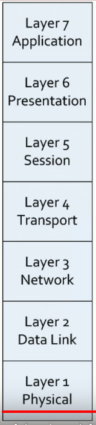

# The Universal Security Control
### Standard issue
- Home, office, and in your OS
### Control the flow of network traffic
- Everything passes through the firewall
### Corporate control of outbound and inbound data
- Sensitive materials
### Control of inappropriate content
- NSFW, parental controls
### Protection against evil
- Anti-virus, anti-malware
# Network-Based Firewall

### Filter traffic by port number or appliation
- OSI layer 4 vs layer 7
- Traditional vs NGFW firewalls
### Encrypt traffic
- VPN between sites
### Most firewalls can be layer 3 devices (routers)
- Often sits on the ingress/egress of the network
- NAT (Network Address Translation) functionality
- Authenticate dynamic routing communication
# UTM/All-In-One Security Appliance
### Unified Threat Management/Web Security Gateway
- Able to handle many different services at the same time
### URL filtering/content inspection
- Can allow or disallow access to certain websites
### Malware inspection
- May be able to identify and block malware before it enters the network
### Spam filter
- Can block unwanted email correspondence within the firewall itself
### CSU/DSU
### Router/Switch
### Firewall
### IDS/IPS
### Bandwith Shaper
- Provides QoS (quality of service) across different applications or protocols
### VPN endpoint
### Many of these devices only operate at layer 4
- Only look at port numbers
- Having all of these capabilities within one device often provides a drawback to performance
- May only turn on a few capabilities before the entire device begins slowing down
# Next-Genration Firewall (NGFW)
### OSI Layer 7 (Application)
- All data in every packet
- Able to make forwarding decisions based on the applications that're being used on the network
### Can be called different names
- Application layer gateway
- Stateful multilayer inspection
- Deep packet inspection
### Requires some advanced decodes
- Every packet must be analyzed and categorized before a security decision is determined
### Network-based Firewalls
- Control traffic flows based on the application
	- Might always allow SQL Server traffic to go through the firewall regardless of the port number
	- Might allow viewing of twitter but not posting
	- Might block YouTube access completely
- Doesn't necessarily rely on a port number to make forwarding decisions
### Intrusion Prevention Systems
- Identify the application
- Apply application-specific vulnerability signatures to the traffic
### Content filtering
- URL filters
- Control website traffic by category
# Web Application Firewall (WAF)
### Not like a "normal" firewall
- Applies rules to HTTP/HTTPS conversations
### Allow or deny based on expected input
- Unexpected input is a common method of exploiting an application
- Can identify SQL injections within a traffic flow and block that from reaching the application server
### Used alongside a next-gen firewall
- Both are looking at different traffic and making different forwarding decisions
- Sometimes we're mandated to have a web app firewall as part of our directive to keep our network safe
### A major focus of Payment Card Industry Data Security Standard (PCI DSS)
- Focuses on providing web app firewalls to be able to better protect these credit card-based applications
