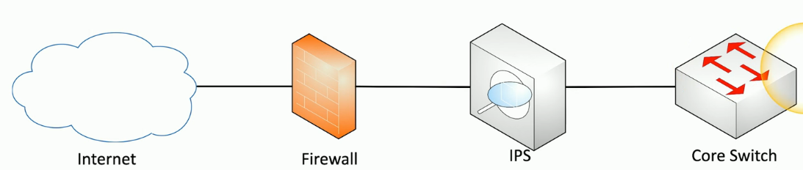
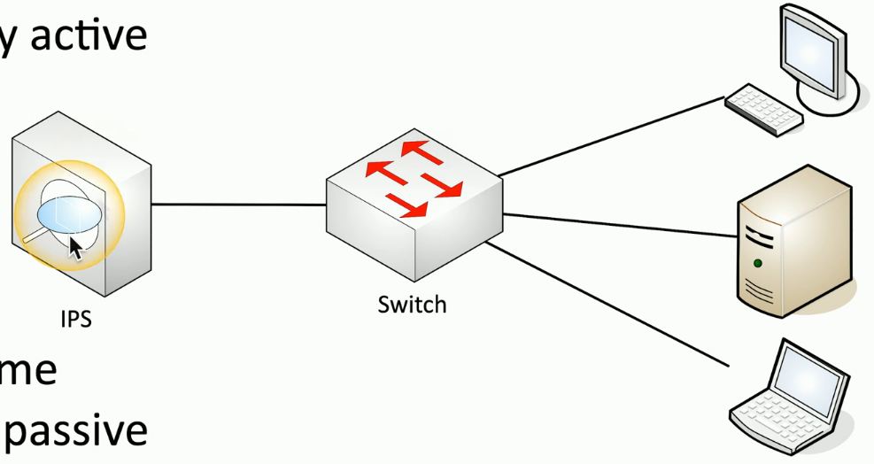
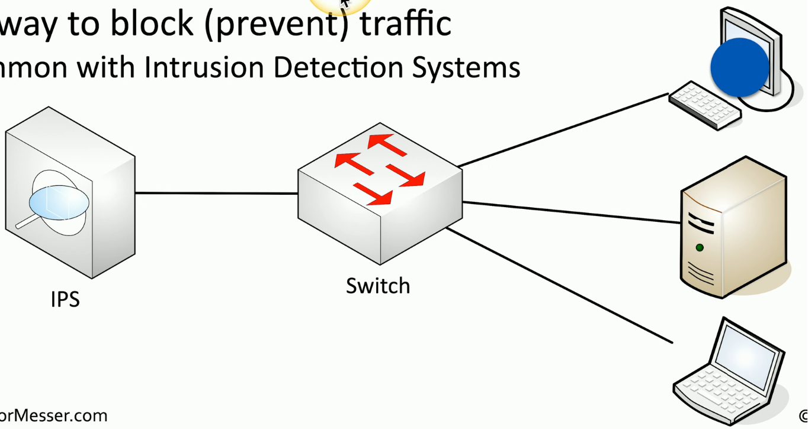

# Intrusion Prevention System (IPS)
### Designed to watch network traffic
- Anything seen as potentially dangerous can be blocked immediately by the IPS
### Intrusions
- Exploits against operating systems, applications, etc.
- Buffer overflows, cross-site scripting, other vulnerabilities
### Detection vs Prevention
- **Intrusion Detection System (IDS)** - Alarm or alert
- **Prevention (IPS)** - Stop it before it gets into the network
# Failure Modes
### We hope for 100% uptime
- This obviously isn't realistic
- Eventually, something will break
### Fail-open
- When a system fails, data continues to flow
### Fail-closed
- When a system fails, data does not flow
### Most networks would prefer fail-open
- But that's not always the case for every security device
- Need to refer to docs to see which failure mode your network has
# Device Connections
### Active Monitoring
- Fail-open vs fail-closed is important here
- System is connected inline
- Data can be blocked in real-time as it passes by
- Intrusion prevention is commonly active
- An example can be seen below:

- In this case, the IPS is put inline doing active monitoring
- As traffice traverses this link between the core switch and the firewall, the IPS is examining all of the traffic
- It makes a decision on whether the traffic is legitimate or potentially maliscious
- It can then block that traffic in the IPS Itself
- Because it's designed to do this in real time, active monitoring is usually the default config
- There may, however, be a concern that an outage would cause downtime for the rest of the network
- Or they might be concerned that it's blocking traffic too aggressively and preventing legit traffic from coming through
- In that case, the org may feel more comfortable with a passive monitoring solution

# Passive Monitoring
- Devices can communicate to each other normally through a switch, and the switch is taking a copy of that traffic and sending it to the IPS
- A copy of the network traffic is examined using a tap or port monitor
- Since the IPS is not inline with the normal network communications between the devices and the switch, it can't cause any downtime to the network
- Because it's not inline, data cannot be blocked in real-time
- Often referred to as an IDS design, even though we're using an IPS, because the IPS is not inline
- Intrusion detection is commonly passive
# Active Monitoring
### IDS/IPS sits physically inline
- All traffic passes through the IDS/IPS
### Malicious traffic is immediately identified
- Dropped at the IPS
- Does not proceed through the network
# Passive Monitoring

### Examine a copy of the traffic
- Port mirror or SPAN (Switch Port Analyzer)
- Network tap to break into a connection
- Any traffic sent to the switch will be duplicated
- One copy will be sent on its way to the destination
- And another copy will be sent to the IPS for evaluation
- This happens with all traffic traversing the switch where a duplicate is made, the destination receives a copy of that traffic, and the IPS also receives a copy of that traffic
### No way to block (prevent) traffic
- This is a great way to identify an alert on malicious traffic, but it obviously isn't stopping the traffic from getting to the destination device
- Common with IDS