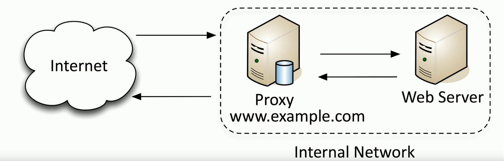

# Jump Server

### Access secure network zones
- Provides an access mechanism to a protected network
### Highly-secured device
- Hardened and monitored
### SSH/Tunnel/VPN to the jump server
- RDP, SSH, or jump from there
### A significant security concern
- Compromise of the jump server is a significant breach
- This is why it's important to take proper steps hardening access to this server so that not anyone on the internet can access it
# Proxies

- Sits between the users and the external network
- Receives the user requests and sends the request on their behalf (the proxy)
- Useful for caching information, access control, URL filtering, content scanning
- **Explicit:** Applications may need to know how to use the proxy
- **Transparent:** Some proxies are invisible
# Application Proxies
### One of the simplest "proxies" is NAT (Network Address Translation)
- A network-level proxy
- Will convert between internal and external IP addresses on a public facing router
### Most proxies in use are application proxies
- The proxy understands the way the application works
### A proxy may only known one application
- HTTP
### Many proxies are multipurpose proxies
- HTTP, HTTPS, FTP, etc.
# Forward Proxy

### An "internal" proxy
- Commonly used to protect and control user access to the internet
- The proxy is able to receive the traffic from the internet and examine it before sending to the user to ensure nothing malicious has been received
# Reverse Proxy

### Inbound traffic from the Internet to your internal service
- Instead of having users from the internet connect directly with the web server, they would instead communicate with the proxy server that makes requests on the user's behalf
- Those responses are then sent from the web server to the proxy server which sends that response back to user on the Internet
- This provides additional security in front of your web server
- If there is any type of malicious traffic inbound, it can be dropped at the proxy rather than being sent to the web server
### Caching benefits using proxy server
- This proxy can also act as a caching server for identical requests coming from the internet
- The first request from the internet would be handled by the proxy, forwarded to the web server for its response, but the response back to the proxy is saved in a local cache
- All subsequent identical requests from the internet are then sent to the proxy server
- Instead of sending that request again to the web server, we simply pull from the cache and send the response directly from the proxy
- This provides a much faster response time for the end users and it limits the amount of load that's being sent to the web server
# Open Proxy

### A third-party, uncontrolled proxy
- Can be a significant security concern
- Often used to circumvent existing security controls
- Instead of your device talking to a proxy or a firewall inside of your network, this information is sent directly to an external proxy, which then makes the request for you to another internet site
### Significant Security Concerns
- This proxy is managed by some third party, but we have no idea who that might be
- That third party could add additional information into these traffic flows that are going back and forth
- The proxy owner could be adding ads into the messages being sent, or they might include malicious code that would infect the devices on your network
- In many orgs, these open proxies are blocked to limit any type of security risk communicating through those unknown devices
# Load Balancer
### Distributing the load
- Multiple servers
- Invisible to the end-user
### Large-scale implementations
- Web server farms, database farms
- Having a load balancer in place maintains efficiency and keeps the load even across all devices
### Fault tolerance
- If a server connected to a load balancer was to fail, the load balancer would recognize that server was no longer communicating and would split the load among the remaining servers
- Server outages have no effect
- Very fast convergence, most users don't realize that a change has been made to the load balancer
# Active/Active Load Balancing
### Configurable load
- Manage across servers
- All of the servers connected to the load balancer are active and are being used by the load balancer
- This allows the single load balancer to manage the load across all of those individual servers
### TCP Offload
- Protocol overhead
- This means that it doesn't have to setup an individual TCP communication session for every user connecting to the servers