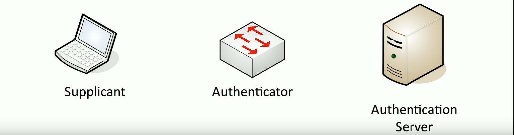
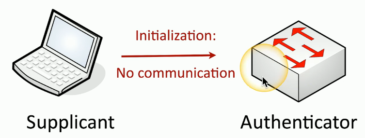
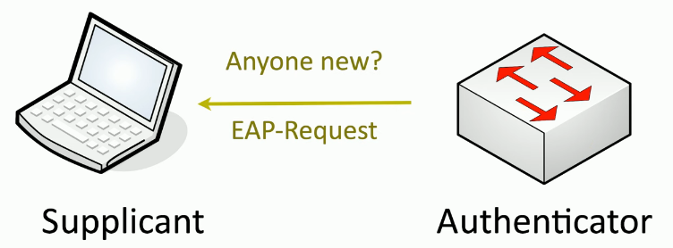
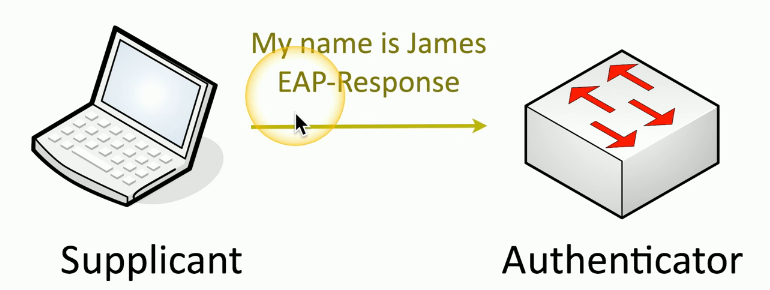
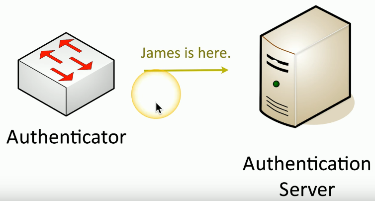
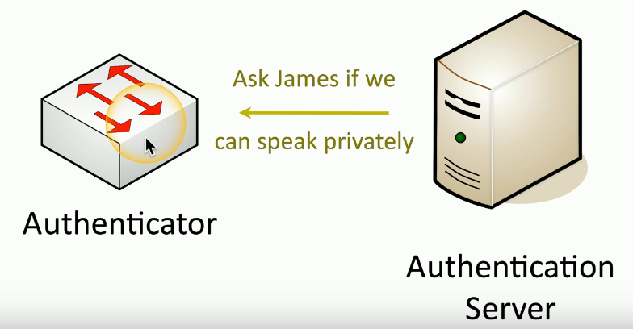
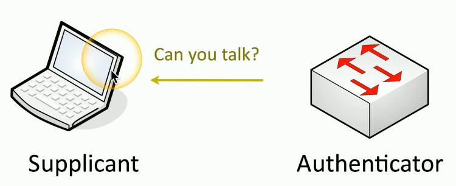
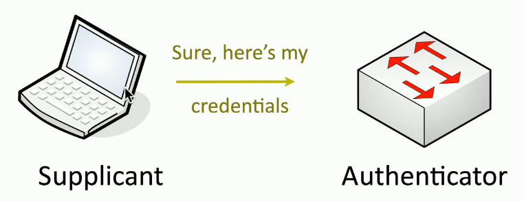
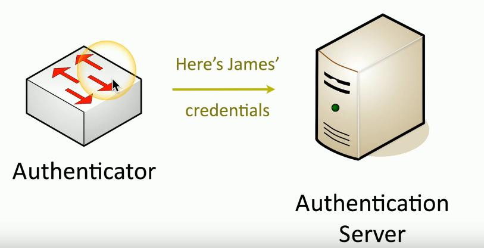
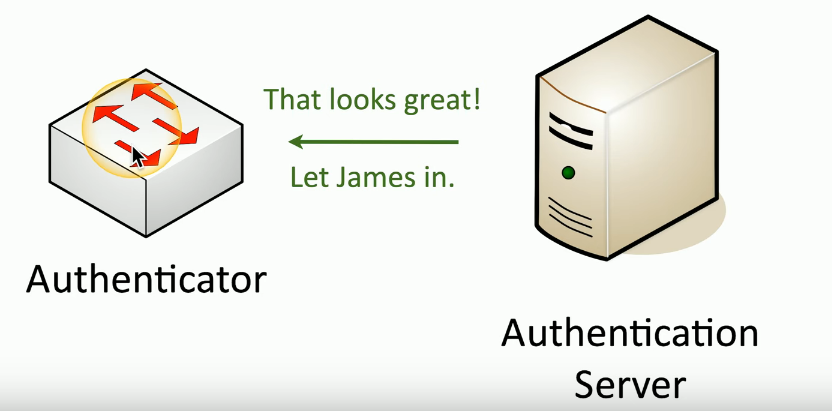

# Port Security
### What is it?
- The security on the individual interfaces that are on a switch or connections to a wireless access point
### We've created many authentication methods through the years
- A network admin has many choices
### Use a username and password
- Other factors can be included
### Commonly used on wireless networks
- Provides authentication before anyone can access the resources on that wireless connection
- Also works on wired networks
# EAP
### Extensible Authentication Protocol
- An authentication framework that can be applied to many different types of networks and connections
### Many different ways to authentication based on RFC standards
- Manufacturers can build their own EAP methods
### EAP integrates with 802.1X
- Prevents access to the network until the authentication succeeds
# IEEE 802.1X
- Port-based NAC (Network Access Control)
- You don't get access to the network until you authenticate
### Used in conjunction with an authentication database
- RADIUS, LDAP, TACACS+, Kerberos, etc.
# IEEE 802.1X and EAP

### Supplicant: The client
### Authenticator: The device that provides access
### Authentication Server: Validates the client credentials

- When the supplicant first connects to the network, there's no authentication, and the authenticator will not allow access to the network until the authentication is complete

- Once the authenticator sees this initialization, it sends a message back to the supplicant asking for login credentials
- We refer to this as the EAP request

- The supplicant provides an EAP response with the name of the device trying to access the network

- That request is passed from the authenticator to the authentication server

- If the server is accepting logins, it'll send a request back to the authenticator asking for additional details that can be used for authentication

- The authenticator sends a request for those additional details to the supplicant

- The supplicant provides the creds required to log in to this network

- The final step will be to confirm that these credentials are correct
- The authenticator then sends those creds to the authentications server

- If the username, password and other login creds match, the authentication replies with successful login and tells the authenticator to allow that user access to the network