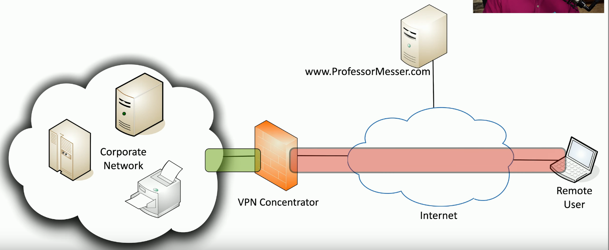
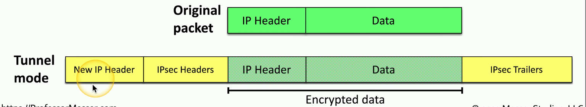
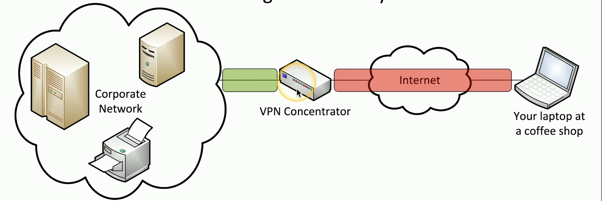
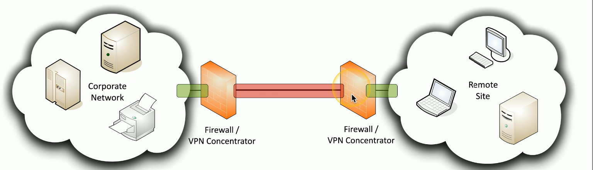
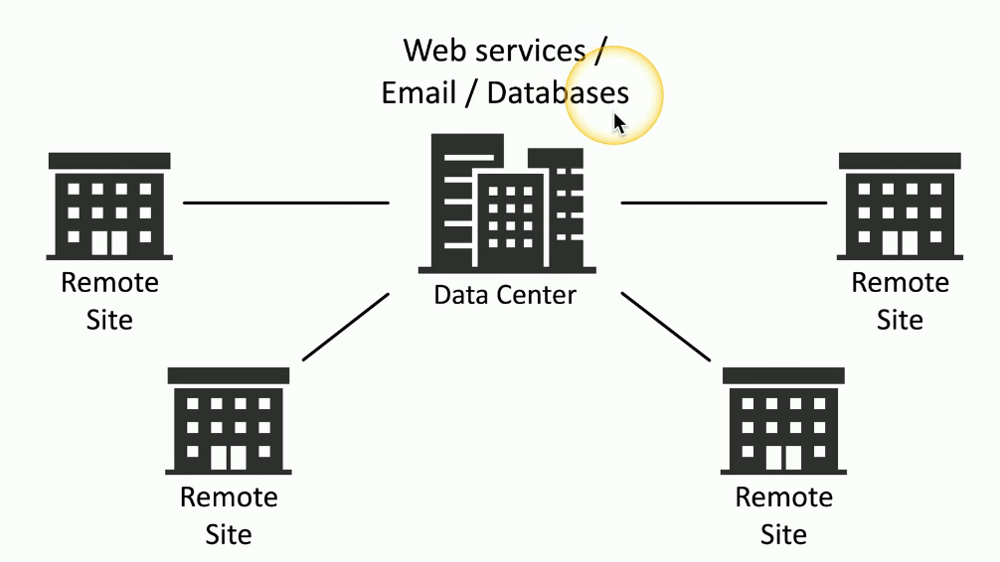
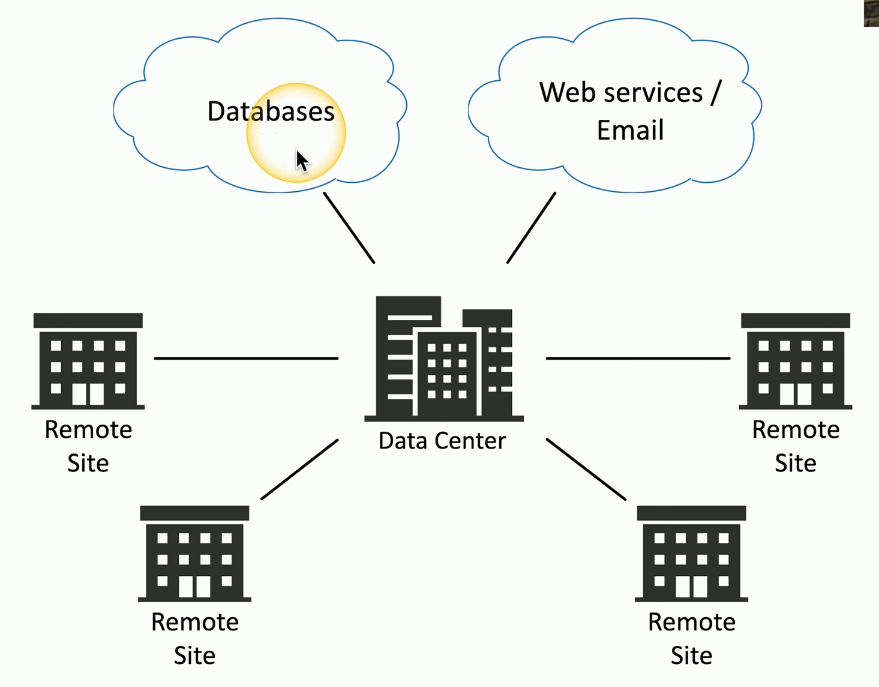
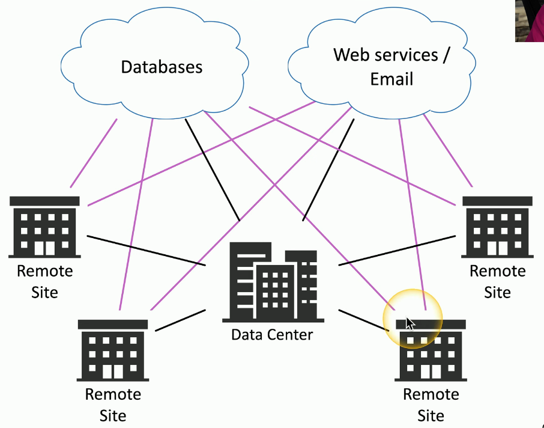
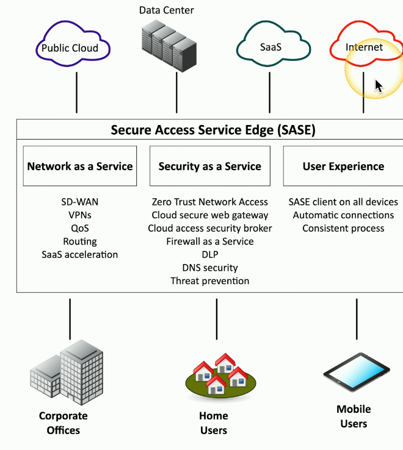

# VPNs
### Virtual Private Networks
- Encrypted (private) data traversing a public network
### VPN Concentrator
- A purpose-built device designed to be the endpoint to using this encrypted link
- Encryption/decryption access device
- Often integrated into a firewall
### Many deployment options
- Specialized cryptographic hardware
- Software-based options available
### Used with client software
- Sometimes built into the OS
# Encrypted Tunnel

- The red section is the encrypted tunnel itself
- All traffic sent from the remote user to the concentrator is all encrypted
- If someone was able to capture this traffic traversing the internet, they would have no idea what was contained within those packets
- The VPN conentrator is responsible for decrypting all of this traffic and sending it in the clear into our corporate network

### Keep data private across the public Internet
- Encryption is key
### Encrypt your data
- Add new headers and trailers
### Decrypt on the other side
- Original data is delivered
# SSL/TLS VPN (Secure Sockets Layer/Transport Layer Security VPN)
### Uses common SSL/TLS Protocol (tcp/443)
- (Almost) no firewall issues due to using the same port numbers that are commonly used for encrypted web communication
### No big VPN clients
- Usually remote access communication
### Authenticate users
- No requirement for digital certificates or shared passwords (like IPSec)
### Can be run from a browser or from a (usually light) VPN client
- Across many operating systems
### SSL/TLS VPN

### On-demand access from a remote device
- Software connects to a VPN concentrator
### Some software can be configured as always-on
# Site-to-site IPSec VPN
### Always-on
- Or almost always
### Firwalls often act as VPN concnetrators
- Probably already have firewalls in place
# SD-WAN
### Software Defined Networking in a Wide Area Network
- A WAN Built for the cloud
### The data center used to be in one place
- The cloud has changed everything
### Cloud-based applications communicate directly to the cloud
- No need to hop through a central point
### Traditional Data Center Design

### Cloud-Based Design

- The cloud has changed where we access those applications
- Instead of having a centralized data center, we've moved our databases, web servers, and email into the cloud or, in some cases, into multiple clouds with different services in each one of those clouds
- This creates a challenge from a network engineering perspective, because all of these remote sites would therefore need to communicate to the data center but then from the data center out to the cloud
- This creates a network inefficiency because it takes multiple hops to get access to those centralized applications
### SD-WAN

- We're still able to communicate to the data center, but can now build out dynamic networks that're able to communicate to our web-based applications
- Now individuals at a remote site that are communicating to databases or web-based applications can use the appropriate network connection over SD-WAN
# Secure Access Service Edge (SASE)
### Update secure access for cloud services
- Securely connect from different locations
### Secure Access Service Edge (SASE)
- A "next gen" VPN
### Security technologies are in the cloud
- Located close to existing cloud services
### SASE clients on all devices
- Streamlined and automatic

- Any of these users would use that SASE connection into the cloud, and from there we're able to securely jump to any cloud-based service we might need
# Selection of Effective Controls
### Many different security options
- Selecting the right choice can be challenging
### VPN
### SSL/TLS VPN for user access
- IPSec tunnels for site-to-site access
### SD-WAN
- Manage the network connectivity to the cloud
- Does not adequately address security concerns
### SASE
- A complete network and security solution
- Requires planning and implementation