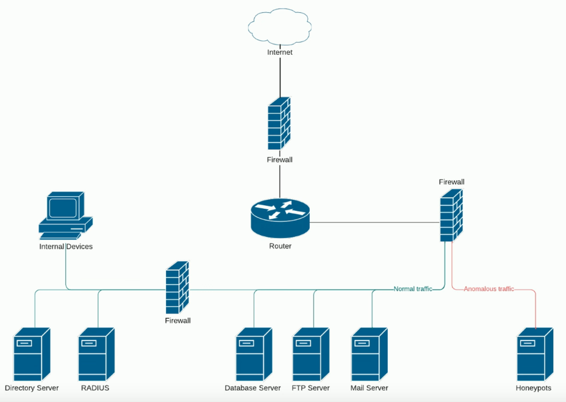

# Device Placement
### Every network is different
- Can vary greatly depending on the organization (Hospital vs Small Business)
- But there are still parts of the network that are very similar to one another
### Firewalls
- Separate trusted from untrusted
- Provide additional security checks
### Other services may require their own security technologies
- Honeypots, jump server, load balances, sensors, etc.
- These can all help create a more secure computing environment
### Example of Network Setup

# Security Zones
### Zone-based security technologies
- More flexible (and secure) than IP address ranges
- Allows us to logically separate all devices on our network by their use or access type
### Each area of the network is associated with a zone
- Basid design: Part of the network can be accessed from the outside, and part is prohibited from outside access
- **Trusted** vs **Untrusted**
	- By themselves these don't tell us what these zones do
- Some orgs refer to these as an **internal** or **external**
- If you wanted to expand on those descriptions, you can have many different names
	- Inside, Internet, Servers, Databases, Screened, etc.
### This simplifies security policies
- Might have a rule that says data is allowed to be sent from a **trusted** zone to an **untrusted** zone
- Might allow access from the outside, the **Untrusted** zone, to a **Screened** zone (where our screen subnet might be)
- In certain circumstances, there may be **untrusted** traffic that is allowed to move onto the **trusted** network
# Security Zones

- A very simple zone configuration where everything on the outside is untrusted, and everything on the inside is trusted

- This is a similar design where we're using an internet zone, a screened zone, and an inside zone
- We have more granularity (higher level of detail, finer/smaller "grain") when we start breaking these up into smaller zones
- This allows us to set more precise security rules in all of our firewalls
# Attack Surface
### How many ways into your home?
- Doors, windows, basements
### Everything can be a vulnerability
- Application code
- Open ports
- Authentication process
- Human error
### Minimize the surface
- Audit the code
- Block ports on the firewall
- Monitor network traffic in real-time
# Connectivity
### Everything contributes to security
- Including the network connection
### Secure network cabling
- Protect the physical drops
- Having access to an available Ethernet connection can be all the attacker needs
### Application-level encryption
- The hard work has already been done
- Even if they're able to capture the packets, they have no idea what's contained inside of those packets
### Network-Level Encryption
- For our remote sites and people connecting from off site, we may want to include addtional encryption for those links
- It's not unusual to build **IPsec tunnels** from site to site or to have a **VPN concentrator** so that anyone on the outside can securely connect to the network
	- **IPsec Tunnels** are VPN connections established between two endpoints across a public network. They provide secure communication by encrypting data traffic between these endpoints.