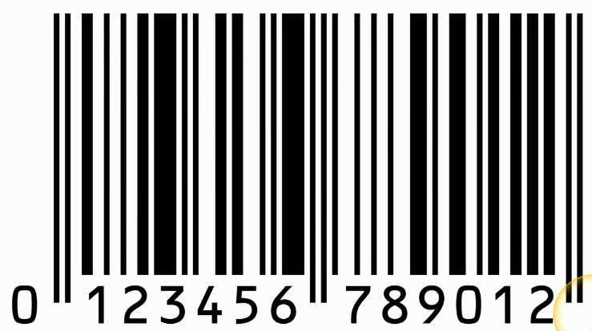

# Data Types
### Regulated
- Managed by a third-party
- Government laws and statutes
### Trade secret
- An org's secret formulas
- Often unique to an organization
### Intellectual property
- May be publicly visible
- Copyright and trademark restrictions
### Legal information
- Court records and documents, judge and attorney information, etc.
- PII and other sensitive details
- Usually stored in many different systems
### Financial information
- Internal company financial details
- Customer financials
- Payment records
- Credit card data, bank records, etc.
### Human-readable
- Humans can understand the data
- Very clear and obvious
### Non-human readable
- Not easily understood by humans
- Encoded data
- Barcodes
- Images
### Some formats are a hybrid
- CSV, XML, JSON, etc.

- This barcode isn't human-readable, however, the numbers on the bottom are and represent the same data
# Classifying sensitive data
### Not all data has the same level of categorization
- License plate numbers vs. medical records
### Different levels require different security and handling
- Additional permissions
- A different process to view
- Restricted network access
# Data Classifications
### Proprietary
- Data that is the property of an organization
- May also include trade secrets
- Often data unique to an organization
### PII - Personally Identifiable Information
- Data that can be used to identify an individual
- Name, date of birth, mother's maiden name, biometric information
### PHI - Protected Health Information
- Health information associated with an individual
- Health status, health care records, payments for health care, and much more
### Sensitive
 - Intellectual property, PII, PHI
### Confidential
- Very sensitive, must be approved to view
### Public/Unclassified
- No restrictions on viewing the data
### Private/Classified/Restricted
- Restricted access, may require an NDA
### Critical
- Data should always be available