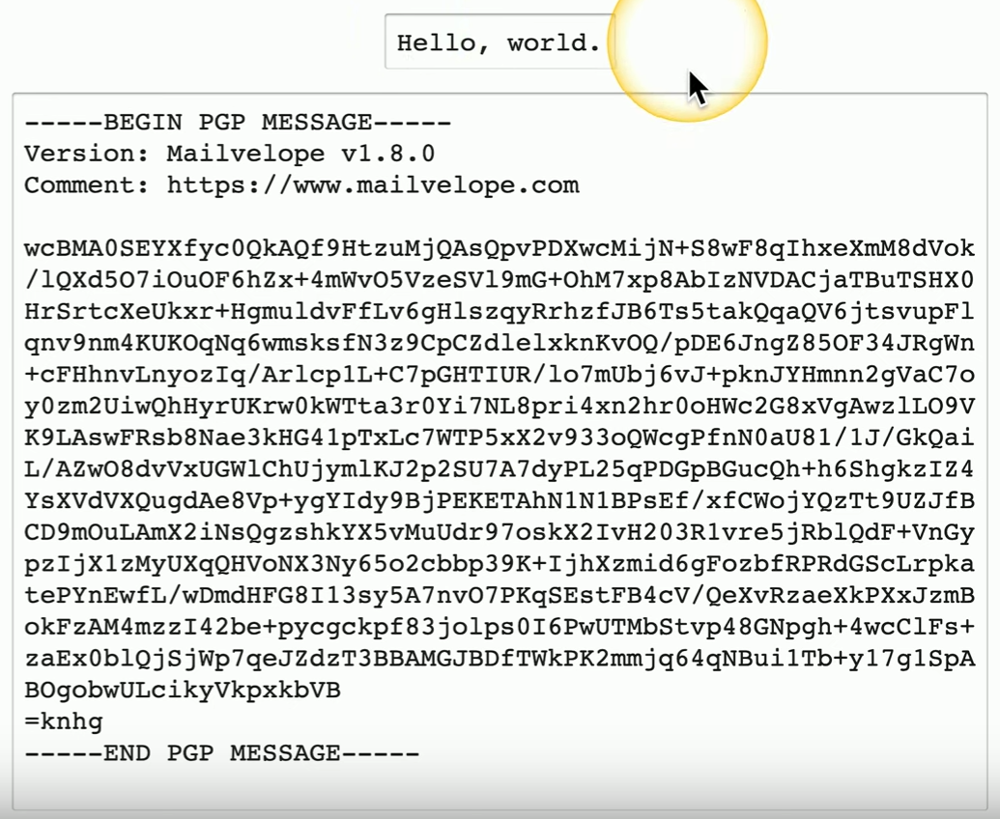
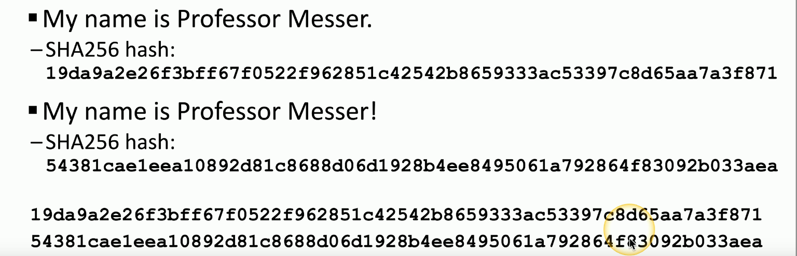
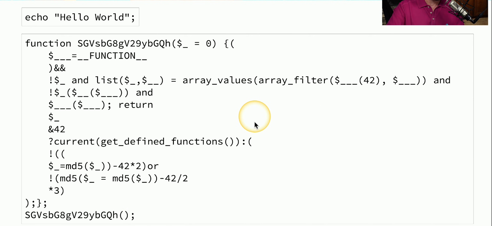
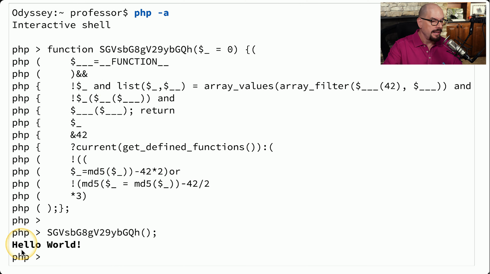
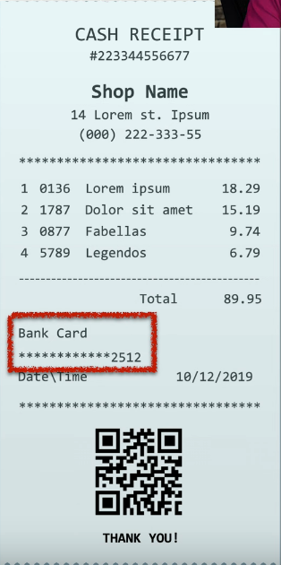
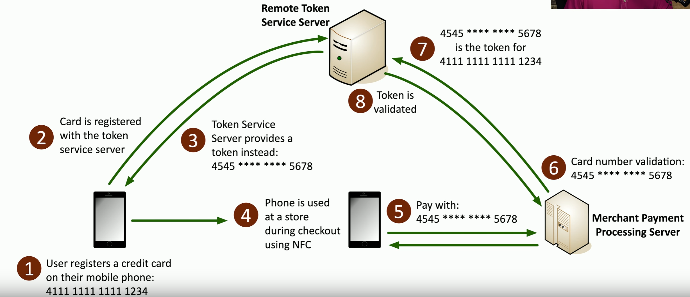

# Geographic Restrictions
### Network location
- Identify based on IP subnet
- Can be difficult with mobile devices
### Geolocation - determine a user's location
- GPS - mobile devices, very accurate
- 802.11 wireless, less accurate
- IP address, not very accurate
### Geofencing
- Automatically allow or restrict access when the user is in a particular location
- Don't allow this app to run unless you're near the office
# Protecting Data 
### A primary job task
- An organization is out of business without data
### Data is everywhere
- On a storage drive, on the network, in a CPU
### Protecting the data
- Encryption, security policies
### Data permissions
- Not everyone has the same access
# Encryption
### Encode information into unreadable data
- Original information is plaintext, encrypted form is ciphertext
### This is a two-way street
- Convert between one and the other
- If you have the proper key
### Confusion
- The encrypted data is drastically different than the plaintext
- Here's an example of PGP encryption and how much it'll change a simple sentence:

# Hashing
### Represent data as a short string of text
- A message digest, a fingerprint
### One-way trip
- Impossible to recover the original message from the digest
- Used to store passwords/confidentiality
### Verify a downloaded document is the same as the original
- Integrity
- Downloading something like a Linux distro will typically include a hash of the original ISO file, if your hash is different after downloading it to your own system then that would mean the file's been tampered with
### Can be a digital signature
- Authentication, non-repudiation, integrity
### Will not have a collision (hopefully)
- Different messages will not have the same hash
# A hashing example
### SHA256 Hash
- 256 bits/64 hexadecimal characters

- Even though only a single character wash changed in that sentence, both hashes are very different from each other
# Obfuscation
### Obfuscate
- Make something normally understandable very difficult to understand
### Take perfectly readable code and turn it into nonsense
- The developer keeps the readable code and gives you the chicken scratch
- This can be done to protect their code base
- Both sets of code perform exactly the same way
### Helps prevent the search for security holes
- Attackers may use this to help hide what exactly is going on with their malicious code
- Makes it more difficult to figure out what's happening
- But not impossible
- There are tools that are able to de-obfuscate certain types of code
# Code Obfuscation

- This obfuscation technique took the original PHP code and changed it to something that looks completely different but still returns the same result

- At the end of it, it did return the same output as the original `echo "Hello World!";` would've
# Masking
### A type of obfuscation
- Hide some of the original data
### Protects PII
- And other sensitive data
### May only be hidden from view
- The data may still be intact in storage
- Control the view based on permissions
### Many different techniques
- Substituting, shuffling, encrypting, masking out, etc.
### Receipt Example

- As seen in the red, our card number was masked so that it wouldn't print out the entire thing on the receipt
- While the companies' credit card reader would know this information in order to accept the payment, there's no need to show it all in plaintext
# Tokenization
### Replace sensitive data with a non-sensitive placeholder
- SSN 266-12-1112 is now 691-61-8539
### Common with credit card processing
- Use a temporary token during payment
- An attacker capturing the card numbers can't use them later
### This isn't encryption or hashing
- The original data and token aren't mathematically related
- No encryption overhead

# Segmentation
### Many organizations use a single data source
- One large database
### One breach puts all of the data at risk
- You're making it easy for the attacker
### Separate the data
- Store it in different locations
### Sensitive data should have stronger security
- The most sensitive data should be the most secure
# Permission Restrictions
### Control access to an account
- It's more than just username and password
- Determine what policies are best for an organization
### The authentication process
- Password policies
- Authentication factor policies
- Other considerations
### Permissions after login
- Another line of defense
- Prevent unauthorized access