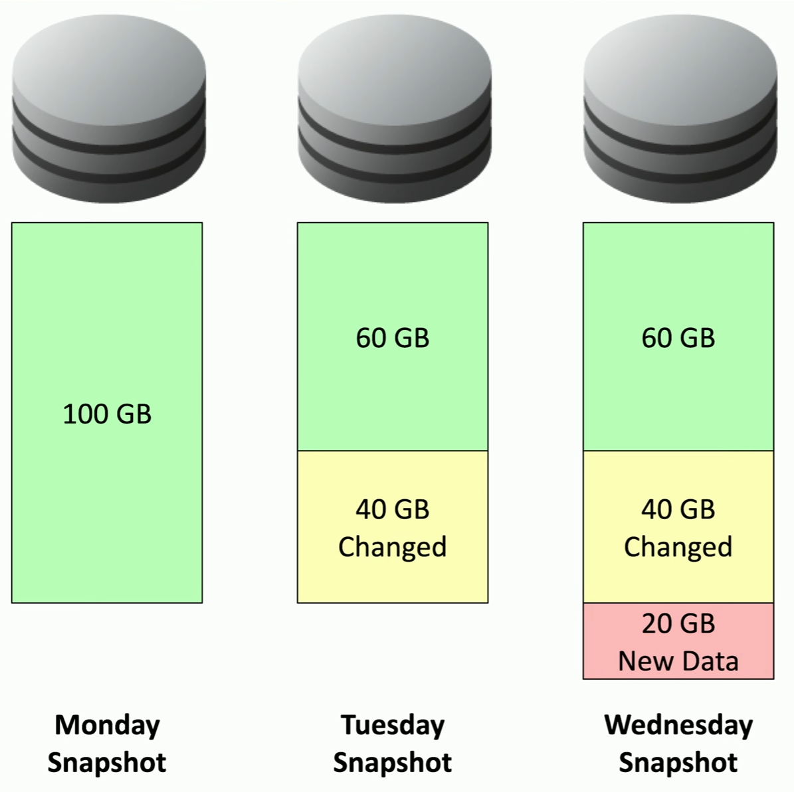

# Backups
### Incredibly important
- Recover important and valuable data
- Plan for disaster
### Many different implementations
- Total amount of data
- Type of backup
- Backup media
- Storage location
- Backup and recovery software
- Day of the week
# Onsite vs Offsite Backups
### Onsite backups
- No internet link required
- Data is immediately available
- Generally less expensive than off site
### Off site backups
- Transfer data over Internet or WAN link
- Data is available after a disaster
- Restoration can be performed from anywhere
### Organizations often use both
- More copies of the data
- More options when restoring
# Frequency
### How often to backup
- Every week, day, hour?
### This may be different between systems
- Some systems may not change much each day
### May have multiple backup sets
- Daily, weekly, and monthly
### This requires significant planning
- Multiple backup sets across different days
- Lots of media to manage
# Encryption
### A history of data is on backup media
- Some of this media may be offsite
### This makes it very easy for an attacker
- All of the data is in one place
### Protect backup data using encryption
- Everything on the backup media is unreadable
- The recovery key is required to restore the data
### Especially useful for cloud backups and storage
- Prevent anyone from eavesdropping
# Snapshots
### Became popular on virtual machines
- Very useful in cloud environments
### Take a snapshot
- An instant backup of an entire system
- Save the current configuration and data
### Take another snapshot after 24 hours
- Contains only the changes between snapshots
### Take a snapshot every day
- Revert to any snapshot
- Very fast recovery
- As seen in the diagram, the snapshots will only modify data that has changed or been newly added compared to the previous snapshot
# Recovery Testing
### It's not enough to perform the backup
- You have to be able to restore
### Disaster recovery testing
- Simulate a disaster situation
- Restore from backup
### Confirm the restoration
- Test the restored application and data
### Perform periodic audits
- Always have a good backup
- Weekly, monthly, quarterly checks
# Replication
### An ongoing, almost real-time backup
- Keep data synced in multiple locations
### Data is available
- There's always a copy somewhere
### Data can be stored locally to all users
- Replicate data to all remote sites
### Data is recoverable
- Disasters can happen at any time
# Journaling
### Power goes out while writing data to storage
- The stored data is probably corrupted
### Recovery could be complicated
- Remove corrupted files, restore from backup
### Before writing to storage, make a journal entry
- After the journal is written, write the data to storage
### After the data is written to storage, update the journal
- Clear the entry and get ready for the next