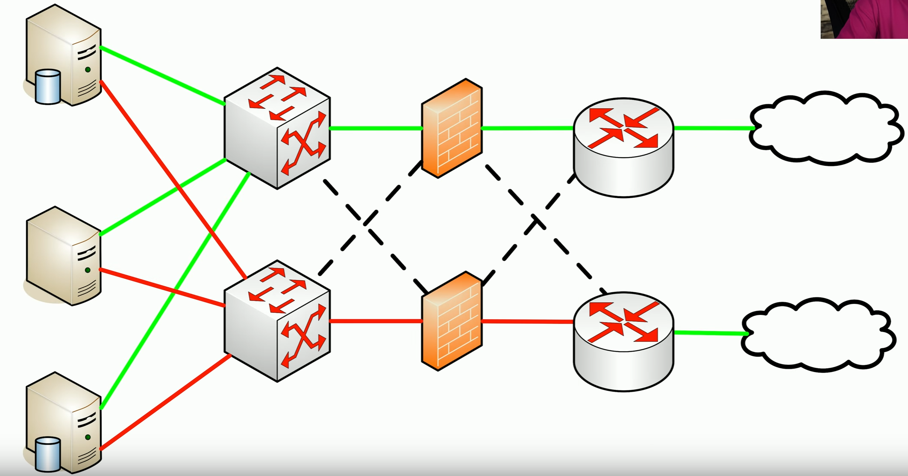

# Recovery Testing
### Test yourselves before an actual event
- Scheduled update sessions (annual, semi-annual, etc.)
### Use well-defined rules of engagement
- Do not touch the production systems
### Very specific scenario
- Limited time to run the event
### Evaluate response
- Document and discuss
# Tabletop Exercises
### Performing a full-scale disaster drill can be costly
- And time consuming
### Many of the logistics can be determined through analysis
- You don't physically have to go through a disaster or drill
### Get key players together for a tabletop exercise
- Talk through a simulated disaster
# Fail Over
### A failure is often inevitable
- It's "when", not "if"
### We may be able to keep running
- Plan for the worst
### Create a redundant infrastructure
- Multiple routers, firewalls, switches, etc.
### If one stops working, fail over to the operational unit
- Many infrastructure devices and services can do this automatically

- Multiple internet connections, routers, firewalls, switches, and servers
- If we do have a break in the link for our primary connection because a device failed, we've always got a secondary link that we could use to gain access to the internet
# Simulation
### Test with a simulated event
- Phishing attack, password requests, data breaches
### Going phishing
- Create a phishing email attack
- Send to your actual user community
- See who bites
### Test internal security
- Did the phishing get past the filter?
### Test the users
- Who clicked?
- Additional training may be required
# Parallel Processing
### Split a process through multiple (parallel) CPUs
- A single computer with multiple CPU cores or multiple physical CPUs
- Multiple computers
### Improved Performance
- Split complex transactions across multiple processors
### Improved recovery
- Quickly identify a faulty system
- Take the faulty device out of the list of available processors
- Continue operating with the remaining processors