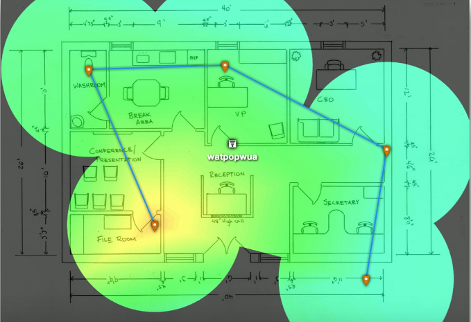

# Site Surveys
### Determine existing wireless landscape
- Sample the existing wireless spectrum
### Identify existing access points
- You may not controll all of them
### Work around existing frequencies
- Layout and plan for interference
### Plan for ongoing site surverys
- Things will certainly change
### Heat maps
- Identify wireless signal strengths

- Areas with more signal have the colors yellow or red
- As signal decreases, that color becomes darker or more blue
# Wireless Survey Tools
- Signal Coverage
- Potential Interference
- Built-in Tools
- 3rd-party Tools
- Spectrum Analyzer
# Mobile Device Management (MDM)
### Manage company-owned and user-owned mobile devices
- BYOD - Bring Your Own Device
### Centralized management of the mobile devices
- Specialized functionality
### Set policies on apps, data, camera, etc.
- Control the remote device
- The entire device or a "partition"
### Manage access control
- Force screen locks and PINs on these single user devices
# BYOD
### Bring Your Own Device/Technology
### Employee owns the device
- Need to meet the company's requirements
### Difficult to secure
- It's both a home device and a work device
- How is data protected?
- What happens to the data when a device is sold or traded in?
# COPE
### Corporate Owned, Personally Enabled
- Company buys the device
- Used as both a corporate device and a personal device
### Organization keeps full control of the device
- Similar to company-owned laptops and desktops
### Information is protected using corporate policies
- Information can be deleted at any time
### CYOD - Choose Your Own Device
- Similar to COPE, but with the user's choice of device
# Cellular Networks
### Mobile devices
- "Cell" phones
- 4G, 5G
### Separate land into "cells"
- Antenna coverages a cell with certain frequencies
### Security concerns
- Traffic monitoring
- Location tracking
- Worldwide access to a mobile device
# WiFi
### Local network access
- Local security probelms
### Same security concerns as other WiFi devices
### Data capture
- Encrypt your data!
### On-path/MITM attack
- Modify and/or monitor data
### Denial of service
- Frequency interference
# Bluetooth
### High speed communication over short distances
- PAN (Personal Area Network)
### Connects our mobile devices
- Smartphones, tethering, headsets and headphones, smartwatches, etc.
### Do not connect to unknown Bluetooth devices
- There's a formal pairing process to prevent unauthorized connections