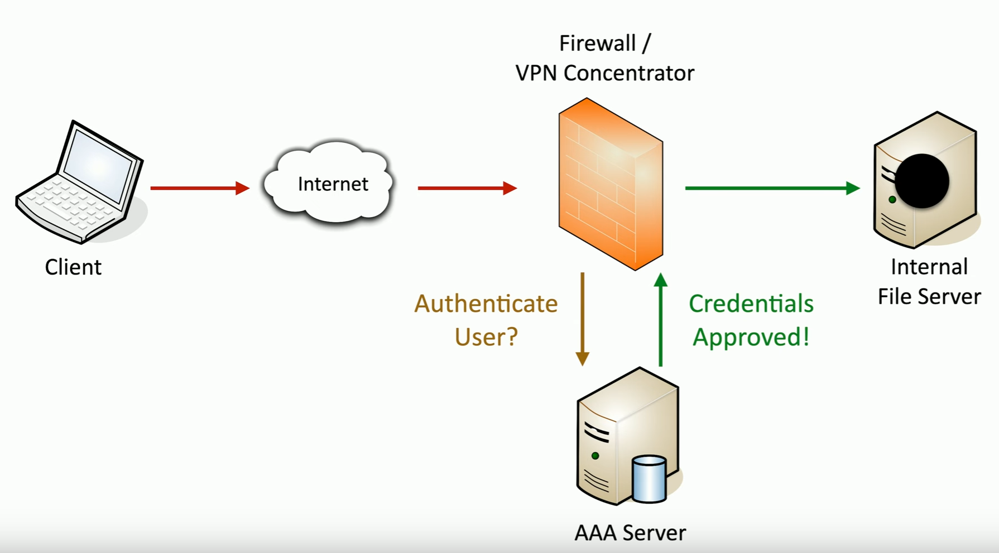

# Securing a Wireless Network
### An organization's wireless network can contain confidential information
- Not everyone is allowed access
### Authenticate the users before granting access
- Who gets access to the wireless network?
- Username, password, multi-factor authentication
### Ensure that all communication is confidential
- Encrypt the wireless data
### Verify the integrity of all communication
- The received data should be identical to the original sent data
- A message integrity check (MIC)
# The WPA2 PSK Problem
### WPA2 has a PSK (pre-shared key) brute-force problem
- Listen to the four-way handshake
	- Some methods can derive the PSK hash without the handshake
- Capture the hash
### With the hash, attackers can brute force the PSK
### This has become easier as technology improves
- A weak PSK is easier to brute force
- GPU processing speeds
- Cloud-based password cracking
### Once you have the PSK, you have everyone's wireless key
- There's no forward secrecy
# WPA3 and GCMP
### WiFi Protected Access 3 (WPA3)
- Introduced in 2018
### GCMP block cipher mode
- Galois/Counter Mode Protocl
- A stronger encryption than WPA2
### GCMP security services
- Data confidentiality with AES
- Message Integrity Check (MIC) with Galois Message Authentication Code (GMAC)
# SAE
### WPA3 changes the PSK authentication process
- Includes mutual authentication
- Creates a shared session key without sending that key across the network
- No more four-way handshakes, no hashes, no brute force attacks
### Simultaneous Authentication of Equals (SAE)
- A Diffie-Hellman derived key exchange with an authentication component
- Everyone uses a different session key, even with the same PSK
- An IEE standard - the dragonfly handshake
# Wireless Authentication Methods
### Gain access to a wireless network
- Mobile users
- Temporary users
### Credentials
- Shared password/pre-shared key (PSK)
- Centralized authentication (802.1X)
### Configuration
- Part of the wireless network connection
- Prompted during the connection process
# Wireless SEcurity Modes
### Configure the authentication on your wireless access point/wireless router
### Open system
- No authentication password is required
### WPA3-Personal/WPA3-PSK
- WPA2 or WPA3 with a pre-shared key
- Everyone uses the same 256-bit key
### WPA3-Enterprise/WPA3-802.1X
- Authenticate users individually with an authentication server (i.e. RADIUS)
# AAA Framework
### Identification
- This is who you claim to be
- Usually your username
### Authentication
- Prove you are who you say you are
- Password and other authentication factors
### Authorization
- Based on your identification and authentication, what access do you have?
### Accounting
- Resources used: login time, data sent/received, logout time
# Gaining Access

- This is assuming the VPN concentrator is configured with 802.1X
- It'll prompt for creds (username and password) and send that to the AAA server for authentication
- Once approved, you now have access to the rest of the network
# RADIUS (Remote Authentication Dial-in User Service)
### One of the more common AAA protocols
- Supported on a wide variety of platforms and devices
- Not just for dial-in
### Centralize authentication for users
- Routers, switches, firewalls
- Server authentication
- Remote VPN access
- 802.1X network access
### RADIUS services available on almost any server OS
# IEEE 802.1X
### IEEE 802.1X
- Port-based Network Access Control (NAC)
- You don't get access to the network until you authenticate
### Used in conjunction with an access database
- RADIUS, LDAP, TACACS+
# EAP
### Extensible Authentication Protocol
- An authentication framework
### Many different ways to authenticate based on RFC standards
- Manufacturers can build their own EAP methods
### EAP integrates with 802.1X
- Prevents access to the network until the authentication succeeds
# IEEE 802.1X and EAP
### Supplicant - The client
### Authenticator - The device that provides access
### Authentication Server - Validates the client credentials