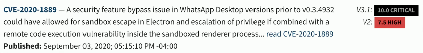
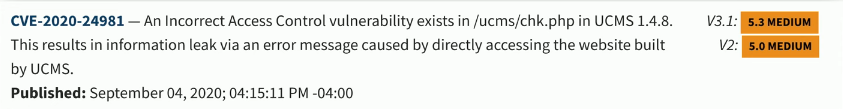
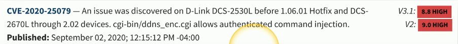

# Dealing With False Information
### False positives
- A vulnerability is identified that doesn't really exist
### This is different from a low-severity vulnerability
- It's real, but it may not be your highest priority
### False negatives
- A vulnerability exists, but you didn't detect it
### Update to the latest signatures
- If you don't know about it, you can't see it
### Work with the vulnerability detection manufacturer
- They may need to update their signatures for your environment
# Prioritizing Vulnerabilities
### Not every vulnerability shares the same priority
- Some may not be significant
- Others may be critical
### This may be difficult to determine
- The research has probably already been done
### Refer to public disclosures and vulnerability databases
- The industry is well versed
- Online discussion groups, public disclosure mailing lists
# CVSS
### National Vulnerability Database:
- https://nvd.nist.gov
- Synced with the CVE list
- Enhanced search functionality
### Common Vulnerability Scoring System (CVSS)
- Quantitative scoring of a vulnerability - 0 to 10
- The scoring standards change over time
- Different scoring for CVSS 2.0 vs CVSS 3.x
### Industry collaboration
- Enhanced feed sharing and automation
# CVE
### The vulnerabilities can be cross-referenced online
- Almost all scanners give you a place to go
### National Vulnerability Database
- https://nvd.nist.gov/
### Common Vulnerabilities and Exposures (CVE)
- https://cve.mitre.org/cve/
### Microsoft Security Bulletins
- https://www.microsoft.com/technet/security/current.aspx
### Some vulnerabilities cannot be definitively identified
- You'll have to check manually to see if a system is vulnerable
- The scanner gives you a heads-up
# Vulnerability Classification
### The scanners looks for everything
- The signatures are the key
### Application scans
- Desktop, mobile apps

### Web application scans
- Software on a web server

### Network scans
- Misconfigured firewalls, open ports, vulnerable devices

# Exposure Factor
### Loss of value or business activity if the vulnerability is exploited
- Usually expressed as a percentage
### A small DDoS may limit access to a service
- 50% exposure factory
### A buffer overflow may completely disable a service
- 100% exposure factor
### A consideration when prioritizing
- Worst possible outcome probably gets priority
# Environmental Variables
### What type of environment is associated with this vulnerability?
- Internal server, public cloud, test lab
### Prioritization and patching frequency
- A device in an isolated test lab
- A database server in the public cloud
- Which environment gets priority?
### Every environment is different
- Number and type of users (internal, external)
- Revenue generating application
- Potential for exploit
# Industry/Organizational Impact
### Some exploits have significant consequences
- The type of organization is an important consideration
### Tallahassee Memorial Health Care - February 2023
- Hit by ransomware and had to close down for 2 weeks
- This diverted emergency cases, as well as resulted in surgeries having to be canceled
### Power utilities - Salt Lake City, Utah and LA County, California - March 2019
- DDoS attacks from an unpatched known vulnerability
# Risk Tolerance
### The amount of risk acceptable to an org
- It's impractical to remove all risk
### The timing of security patches
- Patching immediately doesn't allow for proper testing
### Testing takes time
- While you're testing, you're also vulnerable
### There's a middle ground
- May change based on the severity