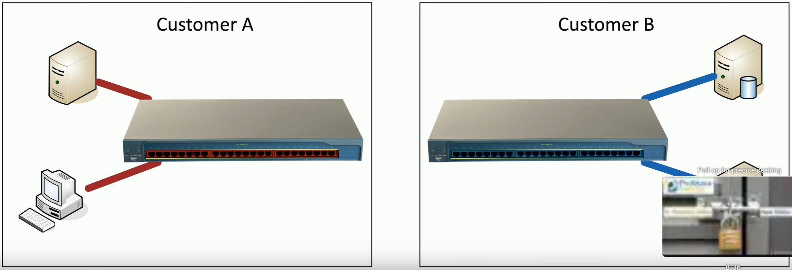
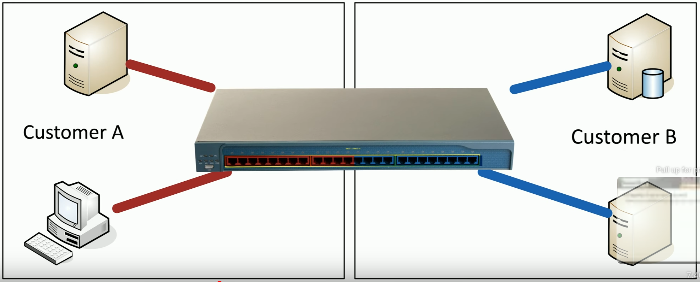

# Patching
### The most common mitigation technique
- We know the vulnerability exists
- We have a patch file to install
### Scheduled vulnerability/patch notices
- Monthly, quarterly
### Unscheduled patches
- Zero day, often urgent
### This is an ongoing process
- The patches keep coming
- An easy way to prevent most exploits
# Insurance
### Cybersecurity Insurance Coverage
- Lost revenue
- Data recovery costs
- Money lost to phishing
- Privacy lawsuit costs
### Doesn't cover everything
- Intentional acts, funds transfers, etc.
### Ransomware has increased popularity of cybersecurity liability insurance
- Applies to every organization
# Segmentation
### Limit the scope of an exploit
- Separate devices into their own networks/VLANs
### A breach would have limited scope
- It's not as bad as it could be
### Can't patch
- Disconnect from the world
- Air gaps may be required
### Use internal Next-Gen Firewalls (NGFWs)
- Block unwanted/unnecessary traffic between VLANs
- Identify malicious traffic on the inside
# Physical Segmentation
### Separate devices
- Multiple units, separate infrastructure

# Logical Segmentation with VLANs
### Virtual Local Area Networks (VLANs)
- Separated logically instead of physically
- Cannot communicate between VLANs without a layer 3 device/router

- Using a Virtual LAN allows us to virtually separate the switch into separate networks
- This would give us the same result as using two different switches as these two VLANs shouldn't be able to communicate with each others
- Only customer B can communicate using the blue interfaces, and vice versa for customer A with the red interfaces
# Compensating Controls
### Optimal security methods may not be available
- Can't deploy a patch right now
- No internal firewalls
### Compensate in other ways
- Disable the problematic service
- Revoke access to the application
- Limit external access
- Modify internal security controls and software firewalls
### Provide coverage until a patch is deployed
- Or similar optimal security response
# Exceptions and Exemptions
### Removing the vulnerability is optimal
- But not everything can be patched
### A balancing act
- Provide the service, but also protect the data and systems
### Not all vulnerabilities share the same severity
- May require local login, physical access, or other criteria
### An exception may be an option
- Usually a formal process to approve
# Validation of Remediation
### The vulnerability is now patched
- Does the patch really stop the exploit?
- Did you patch all vulnerable systems
### Rescanning
- Perform an extensive vulnerability scan
### Audit
- Check remediated systems to ensure the patch was successfully deployed
### Verification
- Manually confirm the security of the system
# Reporting
### Ongoing checks are required
- New vulnerabilities are continuously discovered
### Difficult (or impossible) to manage without automation
- Manual checks would be time-consuming
### Continuous reporting
- Number of identified vulnerabilities
- Systems patched vs unpatched
- New threat notifications
- Errors, exceptions, and exemptions