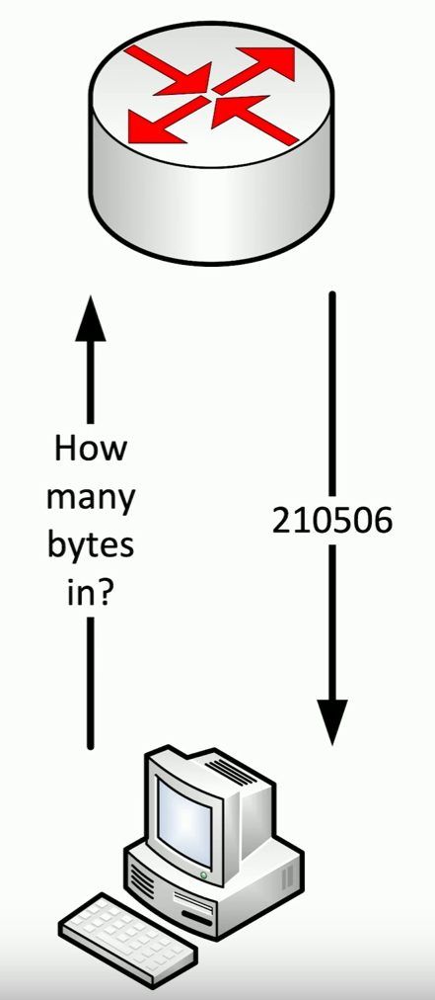

# Security Content Automation Protocol (SCAP)
### Many different security tools on the market
- NGFWs, IPS, vulnerability scanners, etc.
- They all have their own way of evaluating a threat
### Managed by NIST
- https://scap.nist.gov
### Allows tools to identify and act on the same criteria
- Validate the security configuration
- Confirm patch installs
- Scan for a security breach
# Using SCAP
### SCAP content can be shared between tools
- Focused on configuration compliance
- Easily detect applications with known vulnerabilities
### Especially useful in large environments
- Many different operating systems and applications
### This specification standard enabled automation
- Even between different tools
### Automation types
- Ongoing monitoring
- Notification and alerting
- Remediation of noncompliant systems
# Benchmarks
### Apply security best-practices to everything
- Operating systems, cloud providers, mobile devices, etc.
- The bare minimum for security settings
### Example: Mobile Device
- Disable screenshots
- Disable screen recordings
- Prevent voice calls when locked
- Force encrypted backups
- Disable additional VPN profiles
- Configure a "lost phone" message
- Etc.
### Popular benchmarks - Center for Internet Security (CIS)
- https://www.cisecurity.org/cis-benchmarks/
# Agents/Agentless
### Check to see if the device is in compliance
- Install a software agent onto the device
- Run an on-demand agentless check
### Agents can usually provide more detail
- Always monitoring for real-time notifications
- Must be maintained and updated
### Agentless runs without a formal install
- Performs the check, then disappears
- Doesn't require ongoing updates to an agent
- Will not inform or alert if not running
# SIEM
### Security Information and Event Management
- Logging of security events and information
### Log collection for security alerts
- Real-time information
### Log aggregation and long-term storage
- Usually includes advanced reporting features
### Data correlation
- Link diverse data types
### Forensic analysis
- Gather details after an event
# Anti-virus/Anti-malware
### Antivirus is the popular term
- Refers specifically to a type of malware
- Trojans, worms, macro viruses
### Malware refers to the broad malicious software category
- Anti-malware stops spyware, ransomware, fileless malware, etc.
### The terms are effectively the same these days
- The names are more of a marketing tool
- Anti-virus software is also anti-malware software now
- Make sure your system is using a comprehensive solution
# Data Loss Prevention (DLP)
### Where's your data?
- SSN, credit card numbers, medical records
- DLP is used to look for and block any type of data that you don't want running on your network
### Stop the data before the attacker gets it
- Data "leakage"
### So many sources, so many destinations
- Often requires multiple solutions
- Endpoint clients
- Cloud-based systems
	- Email, cloud storage, collaboration tools
# SNMP
### Simple Network Management Protocol
- A database of data (MIB) - Management Information Base
- The database contains OIDs - Object Identifiers
- Poll devices over UDP/161

### Request stats from a device
- Server, firewall, workstation, switch, router, etc.
### Poll devices at fixed intervals
- Create historical performance graphs
# SNMP Traps
### Most SNMP operations expect a poll
- Devices then respond to the SNMP request
- This requires constant polling
### SNMP traps can be configured on the monitored device
- Communicates over UDP/162
### Set a threshold for alerts
- If the number of CRC errors increases by 5, send a trap
- Monitoring stations can react immediately
# NetFlow
### Gather traffic stats from all traffic flows
- Shared communication between devices
### NetFlow
- Standard collection method
- Many products and options
### Probe and collector
- Probe watches network communication
- Summary records are sent o thte collector
### Usually a separate reporting app
- Closely tied to the collector
# Vulnerability Scanners
### Usually minimally invasive
- Unlike a penetration test
### Port scan
- Poke around and see what's open
### Identify systems
- And security devices
### Test from the outside and inside
- Don't dismiss insider threats
### Gather as much information as possible
- We generally have to go through vulnerability reports to separate the real vulnerabilities from the false positives