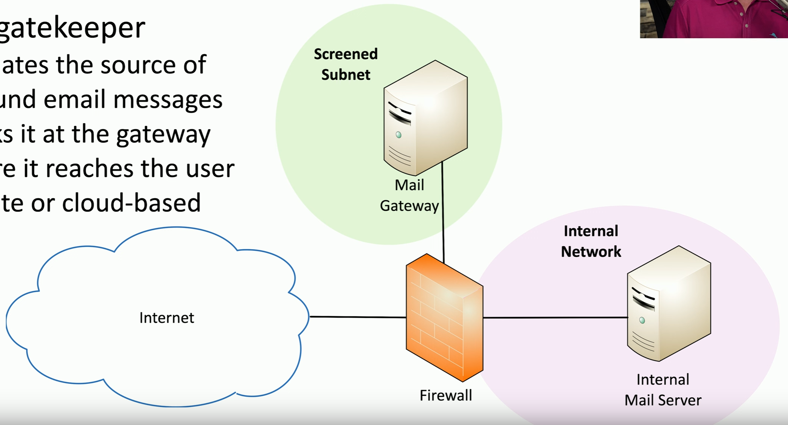
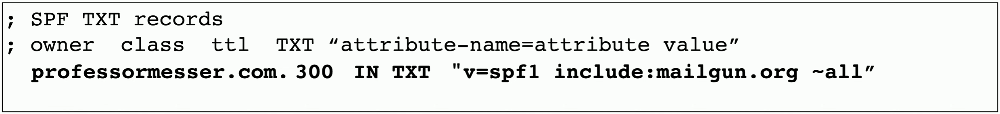
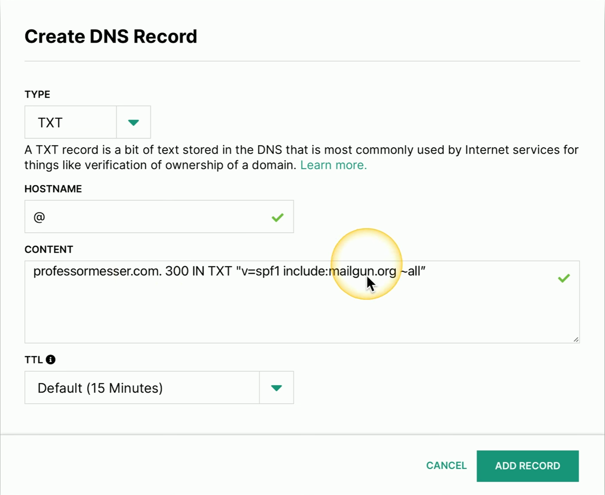
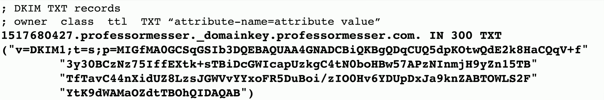
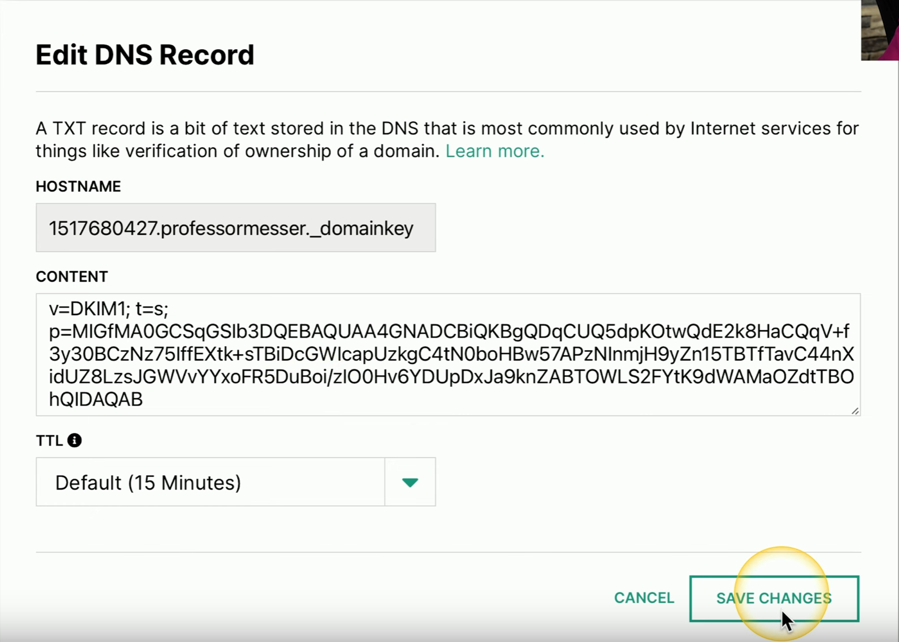
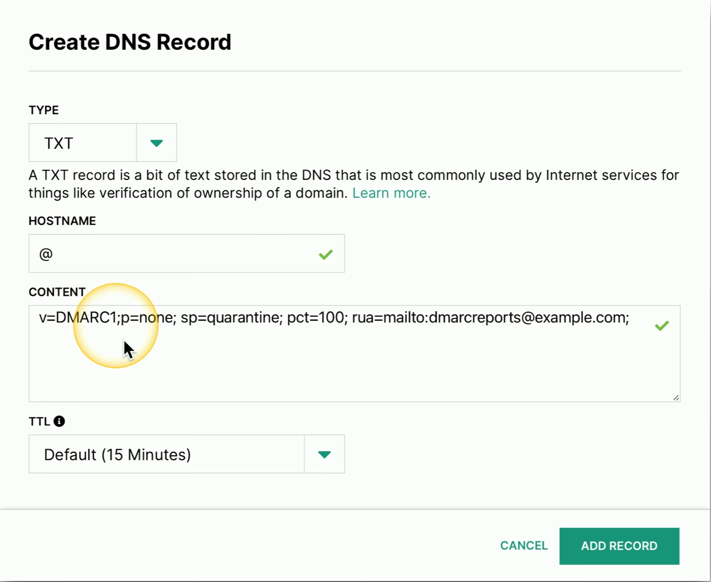
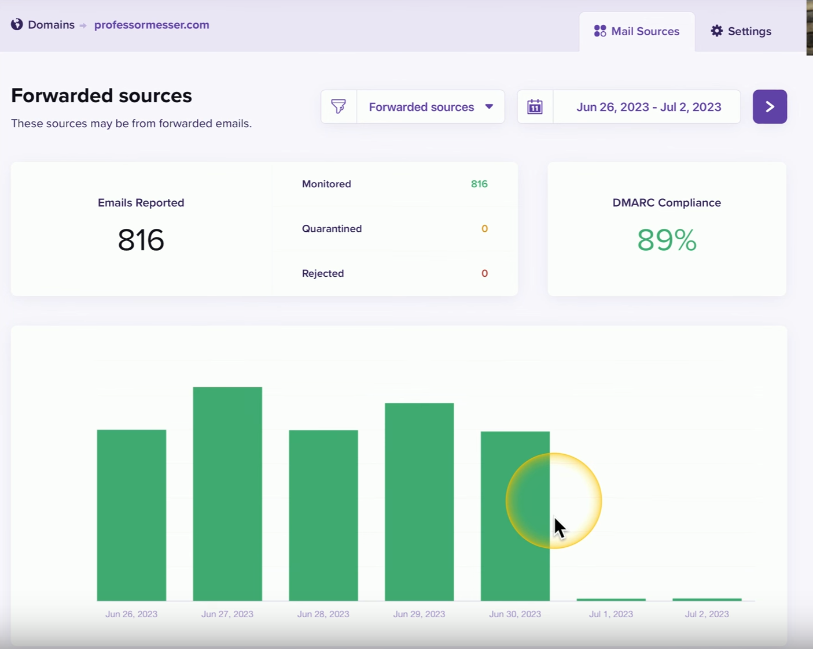

# Email Security Challenges
### The protocols used to transfer emails include relatively few security checks
- It's very easy to spoof an email
### Spoofing happens all the time
- Check your spam folder
### The email looks as if it originated from james@professormesser.com
- But did it? How can you tell?
### A reputable sender will configure email validation
- Publicly available on the sender's DNS server
# Mail Gateway
### The gatekeeper
- Evaluates the source of inbound email messages
- Blocks it at the gateway before it reaches the user
- On-site or cloud-based

# Sender Policy Framework (SPF)
### SPF Protocol
- Sender configures a list of all servers authorized to send emails for a domain
### List of authorized mail servers are added to a DNS TXT record
- Receiving mail servers perform a check to see if incoming mail really did come from an authorized host

# Adding an SPF TXT Record

# Domain Key Identified Mail (DKIM)
### A mail server digitally signs all outgoing mail
- The public key is in the DKIM TXT record
### The signatures is validated by the receiving mail servers
- Not usually seen by the end user

# Adding a DKIM TXT Record

# DMARC
### Domain-Based Message Authentication, Reporting, and Conformance
- An extension of SPF and DKIM
### The domain owner decided what receiving email servers should do with emails not validating using SPF and DKIM
- That policy is written into a DNS TXT record
- Accept all, send to spam, or reject the email
### Compliance reports are sent to the email admin
- The domain owner can see how many emails are received
# Adding a DMARC TXT Record

# DMARC Reports
