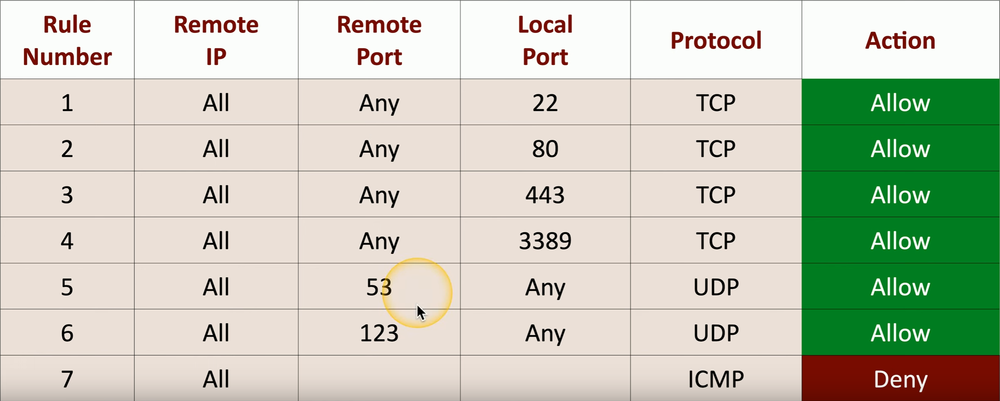
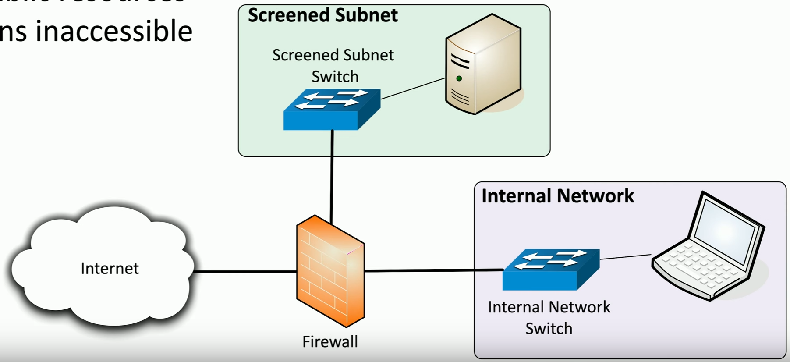

# Network-based Firewalls
### Filter traffic by port number or application
- Traditional vs NGFW
### Encrypt traffic
- VPN between sites
### Most firewalls can be layer 3 devices (routers)
- Often sits on the ingress/egress of the network
- Network Address Translation (NAT)
- Dynamic Routing
# NGFW (Next-Gen Firewalls)
### The OSI Application Layer
- Layer 7 firewall
### Can be called different names
- Application layer gateway
- Stateful multilayer inspection
- Deep packet inspection
### Requires some advanced decodes
- Every packet must be analyzed, categorized, and a security decision determined
# Ports & Protocols
### Make forwarding decisions based on protocol (TCP or UDP) and port number
- Traditional port-based firewalls
- Add to an NGFW for additional security policy options
### Based on destination protocol and port
- Web Server: TCP/80, TCP/443
- SSH Server: TCP/22
- Microsoft RDP: TCP/3389
- DNS Query: UDP/53
- NTP (Network Time Protocol): UDP/123
# Firewall Rules
### A logical path
- Usually top-to-bottom
### Can be a very general or very specific
- Specific rules are usually at the top
### Implicit deny
- Most firewalls include an auto deny for any unspecified rules
### Access Control Lists (ACLs)
- Allow or disallow traffic
- Groupings of categories:
	- Source IP
	- Destination IP
	- Port Number
	- Time of Day
	- Application
	- Etc.
# Web Server Firewall Ruleset

- Assuming this firewall is also configured as an implicit deny, any traffic coming to the firewall that doesn't match any of these rule numbers would be automatically denied
# Screened Subnet
### An additional layer of security between you and the Internet
- Public access to public resources
- Private data remains inaccessible

- Screened subnet commonly holds services and devices that needs to be accessed by the internet
# IPS Rules
### Intrusion Prevention System
- Usually integrated into a NGFW
### Different ways to find malicious traffic
- Look at traffic as it passed by
### Signature-based
- Look for a perfect match
### Anomaly-based
- Build a baseline of what's "normal"
- Unusual traffic patterns are flagged
### You determine what happens when unwanted traffic appears
- Block, allow, send an alert, etc.
### Thousands of rules
- Or more
### Rules can be customized by group
- Or as individual rules
### This can take time to find the right balance
- Security/alert "noise"/false positives