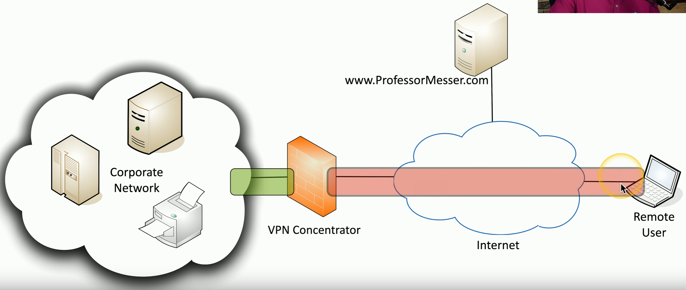

# Unencrypted Network Data
### Network traffic is important data
- Everything must be protected
### Some protocols aren't encrypted
- All traffic sent in the clear
- Telnet, FTP, SMTP, IMAP
### Verify with a packet capture
- view everything sent over the network
# Protocol Selection
### Use a secure application protocol
- Built-in encryption
### A secure protocol may not be available
- This may be a deal-breaker

# Port Selection
### Secure and insecure application connections may be available
- It's common to run secure and insecure on different ports
### HTTP and HTTPS
- In-the-clear and encrypted web browsing
- HTTP: Port 80
- HTTPS: Port 443
### The port number doesn't guarantee security
- Confirm the security features are enabled
- Packet captures may be necessary
# Transport Method
### Don't rely on the application
- Encrypt everything over the current network transport
### 802.11 Wireless
- Open access point: No transport-level encryption
- WPA3: All user data is encrypted
### VPN
- Create an encrypted tunnel
- All traffic is encrypted and protected
- Often requires 3rd party services and software
