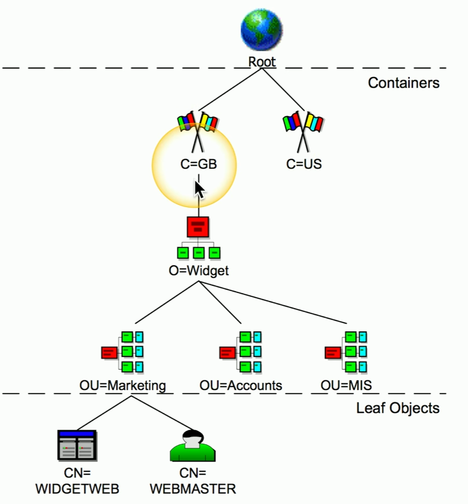

# Identity & Access Management (IAM)
### Applications are available anywhere
- Desktop, browser, mobile device, etc.
### Data can be located anywhere
- Cloud storage, private data centers, etc.
### Many different application users
- Employees, vendors, contractors, customers
### Give the right permissions to the right people at the right time
- Prevent unauthorized access
### Identify lifecycle management
- Every entity (human and non-human) gets a digital identity
### Access control
- An entity only gets access to what they need
### Authentication and authorization
- Entities must prove they are who they claim to be
### Identity governance
- Track an entity's resource access
- May be a regulatory requirement
# Provisioning/De-Provisiong User Accounts
### The user account creation process
- And the account removal process
### Provisioning and de-provisiong occurs for certain events
- Hiring, transfers, promotions, job separation
### Account details
- Name, attributes, group permissions, other permissions
### An important part of the IAM process
- An initial checkpoint to limit access
- Not just anybody gets Admin access
# Permission Assignments
### Each entity gets limited permissions
- Just enough to do their job (least privilege)
- Group assignments are common
### Storage and files can be private to that users
- Even if another person is using the same computer
### No privileged access to the OS
- Specifically not allowed on a user account
# Identity Proofing
### I could be anyone
- The IAM process should confirm who I am
### Resolution
- Who the system thinks you are
### Validation
- Gathering information from the user (password, security questions, etc.)
### Verification/Attestation
- Passport, in-person meeting, etc.
- Automated verification is also an option
# Gaining Access

# Single Sign-on (SSO)
### Provide credentials one time
- Get access to all available or assigned resources
- No additional authentication required
### Usually limited by time
- A single authentication can work for 24 hours
- Authentication again after the timer expires
### The underlying authentication infrastructure must support SSO
- Not always an option
# LDAP (Lightweight Directory Access Protocol)
### Protocol for reading and writing directories over an IP network
- An organized set of records, like a phone directory
### X.500 specification was written by the Internal Telecommunications Union (ITU)
### DAP ran on the OSI protocol stack
- LDAP is lightweight
### LDAP is the protocol used to query and update an X.500 directory
- Used in Windows Active Directory, Apple OpenDirectory, Novell eDirectory, etc.
# X.500 Distinguished Names
### *attribute=value* pairs
### Most specific attribute is listed first
- This may be similar to the way you already think

# X.500 Directory Information Tree
### Hierarchical structure
- Builds a tree
### Container objects
- Country, organization, organization units
### Leaf objects
- Users, computers, printers, files

# Security Assertion Markup Language (SAML)
### Open standard for authentication and authorization
- You can authenticate through a 3rd party to gain access
- One standard does it all, sort of
### Not originally designed for mobile devices
- This has been SAML's largest roadblock
# The SAML Authentication Flow

# OAuth
### Authorization framework
- Determines what resources a user will be able to access
### Created by Twitter, Google, and many others
- Significant industry support
### Not an authentication protocol
- OpenID Connect handles the SSO authentication
- OAuth provides authorization between applications
### Example OAuth Authorization Screen

# Federation
### Provide network access to others
- Not just employees - Partners, suppliers, customers, etc.
- Provides SSO and more
### Third-parties can establish a federated network
- Authenticate and authorize between the two organizations
- Login with your Facebook credentials
### The 3rd parties must establish a trust relationship
- And the degree of trust
### Example

# Interoperability
### Many different ways to communicate with an authentication server
- More than a simple login process
### Often determined by what is at hand
- VPN concentrator can talk to an LDAP server
- Your org may already have one
### A new app uses OAuth
- Need to allow authentication API access
### The interoperability is dependent on the environment
- This is often part of a much larger IAM strategy